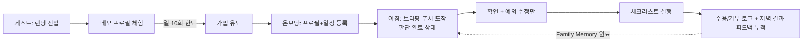

# 아이데이 (AiDay) — PRD

> **아이데이** — 오늘의 환경을 내 아이 기준으로 해석해, 부모의 하루 첫 육아 판단(옷차림·준비물·오늘의 케어 방식)을 대행하는 **데일리 케어 브리핑** AI

| 항목 | 내용 |
|------|------|
| **팀명** | 아이데이 (AiDay) |
| **작성일** | 2026-07-08 (최종 개정 2026-07-12) |
| **문서 버전** | v2.7.2 — 변경 이력은 [버전 히스토리](#버전-히스토리) 참조 |
| **문서 성격** | 프로토타입 v0.3 기준선 위에 쌓는 **고도화 PRD** — 6주 내 **출시 블로커 해소 + 7일 컨시어지 테스트 → 확산 판단**이 목표 (내부·엔지니어링·디자인 3종 리뷰 반영, v2.7) |
| **라이브 데모** | https://aiday-demo.vercel.app |

> [!NOTE]
> **보조 문서 지도** — 이 PRD가 참조하는 원천 문서들. 본 PRD는 단독으로 읽히도록 핵심 내용을 본문에 담고 있으며, 아래 링크는 심화 참조용이다(GitHub 저장소 기준 상대경로 — PDF 등 저장소 밖 열람 시에는 링크가 동작하지 않을 수 있다).
>
> | 내용 | 문서 |
> |------|------|
> | 문제정의·페르소나 원본 | [docs/문제정의-프레임워크-v2.md](docs/문제정의-프레임워크-v2.md) |
> | 존재 이유·설계 원칙 | [MANIFESTO.md](MANIFESTO.md) |
> | 전체 화면 명세·구현 현황 | [SPEC.md](SPEC.md) |
> | 디자인 시스템 | [DESIGN.md](DESIGN.md) |
> | 성공 지표·출시 기준·제품 결정 | [docs/PRODUCT-DECISIONS.md](docs/PRODUCT-DECISIONS.md) |

### 용어 정의

본문에서 반복 사용하는 내부 용어:

| 용어 | 정의 |
|------|------|
| **브리핑** | 아이데이가 매일 아침 생성하는 데일리 케어 리포트 — 한 줄 결론(훅) + 해석 + 실행 체크리스트로 구성 |
| **훅(hook)** | 브리핑 최상단의 한 줄 핵심 결론 (예: "일교차 11° — 겹쳐 입기 필수"). 홈 카드와 푸시 알림 제목에 공통 사용 |
| **Family Memory** | 부모가 브리핑의 액션을 수용/거부한 이력을 축적해 다음 판단에 반영하는 개인화 메모리. 엔진 자체는 장기 로드맵이며, 본 PRD에서는 그 원료가 되는 로그 수집만 시작한다 |
| **구조화 판단 파이프라인** | LLM이 결론만 내지 않고 정해진 단계(환경 궤적 → 일정 교차 → 체질 리스크 → 우선순위 → 액션)를 거치되, **숨은 추론 과정은 출력·저장하지 않고 각 단계의 구조화된 결과(적용 규칙·주요 요인·근거)만 산출**하도록 프롬프트에 명시하는 방식. 재현·검증 용이성을 위해 "추론 과정 노출(CoT)"이 아니라 "근거 데이터 산출"로 설계한다 |
| **골든 케이스** | 판단 엔진 품질을 검증하는 고정 입력 표준 시나리오 모음(20~30개). 서연 케이스를 포함하며, 판단 엔진 변경 시 자동 평가(`scripts/eval-briefing.ts`)로 전체 통과를 확인한다 |
| **브리핑 단일 원본** | 아이당 하루 1회 생성해 `daily_briefings` 테이블에 저장하는 확정 브리핑 레코드. 홈과 (7일 테스트 동안 수동) 발송 메시지가 같은 레코드를 재사용해 내용 불일치를 방지한다. 자동 알림 채널(웹 푸시)은 테스트 이후 같은 원본을 재사용한다 |
| **OverEdge** | 아이데이의 모체가 되는 창업 아이디어 기술서(장기 사업 로드맵)의 명칭. 본 PRD(6주) 범위 밖의 장기 계획을 지칭할 때 사용 |
| **사전 설문** | 2026년 5월, 목업 MVP 화면을 제시하고 수행한 온라인 가설검증 설문(Google Forms, **n=17** — 자녀 있음 13명, 만 1~8세 부모 중심, 맞벌이 70.6%). 구 문서의 "FGI" 표기를 정정한 것 — 대면 그룹 인터뷰가 아니라 구조화 문항 기반 설문이다. 문항·집계 원본: [docs/validation/2026-05-사전-가설검증-설문.md](docs/validation/2026-05-사전-가설검증-설문.md) |

**차례**

1. [작성자 소개](#01-작성자-소개)
2. [어떤 분야에 AI를 도입하려고 하는가](#02-어떤-분야에-ai를-도입하려고-하는가)
3. [현재 어떤 문제가 있는가](#03-현재-어떤-문제가-있는가)
4. [사용자는 누구인가](#04-사용자는-누구인가)
5. [문제 해결을 위한 기능](#05-문제-해결을-위한-기능)
6. [사용자 시나리오](#06-사용자-시나리오)
7. [화면 정의 ⭐](#07-화면-정의-)
8. [기술 요구사항 ⭐](#08-기술-요구사항-)
9. [데이터 확보 방안](#09-데이터-확보-방안)
10. [구현 방안 및 일정](#10-구현-방안-및-일정)
11. [성과 측정 방법 (KPI)](#11-성과-측정-방법-kpi)
12. [역할 분담](#12-역할-분담)

---

## 01. 작성자 소개

| 이름 | 역할 | 이메일 |
|------|------|--------|
| 이은상 | 기획·검수·의사결정 총괄 (1인 개발) | katherineeslee@gmail.com |
| Claude Code | AI 협업 도구 — 구현·코드 리뷰·QA 실행 ([섹션 12](#12-역할-분담) 참조) | — |

---

## 02. 어떤 분야에 AI를 도입하려고 하는가

부모가 매일 반복하는 육아 의사결정의 **첫 번째 판단 — 오늘의 환경 정보(날씨·미세먼지·꽃가루·자외선 등)를 내 아이 기준으로 해석해 옷차림·준비물·오늘 하루의 케어 방식을 결정하는 일** — 을 AI가 대행한다.

> 환경 해석에서 시작되는 **부모의 하루 첫 육아 판단 그 자체**를 지원한다.
> 외출·등원은 그 판단이 실행되는 대표적인 첫 육아 액션이다.
> (포지셔닝 원칙 전문: [docs/문제정의-프레임워크-v2.md](docs/문제정의-프레임워크-v2.md) — 기준 축)

**비즈니스 가치:** 이 판단은 매일 아침 반복되므로, 성공하면 데일리 리텐션이 구조적으로 내장된 서비스가 된다 — 단, "매일 쓰는가"는 전제가 아니라 본 PRD가 검증할 핵심 가설이다. 사용할수록 아이 프로필과 수용/거부·결과 피드백 이력(Family Memory 원료)이 쌓여 "내 아이를 아는 서비스"라는 전환 장벽이 형성될 수 있다 — 이 역시 아직 **개인화 데이터 우위 가설**이다. 프로필(나이·체질)만으로는 우위가 되지 않으며, "오늘 추천이 실제로 맞았는가"라는 결과 라벨이 누적되고 추천 개선으로 이어질 때 비로소 성립한다. 본 PRD는 그 원료(수용/거부 로그 + 저녁 결과 피드백)를 운영 DB에 수집하는 단계까지를 범위로 한다. 수익화(프리미엄 케어 리포트, 육아용품 제휴 등)는 **7일 테스트로 핵심 루프가 확인되고 이후 확산 단계에서** "매일 쓰는 서비스인가"(아침 재방문율, [섹션 11](#11-성과-측정-방법-kpi))를 검증한 뒤 결정한다. 사전 설문 기준 사용 의향은 88.2%(15/17, 목업 제시 후)로 높으나 이는 의향이지 행동 증거가 아니고, 지불 의사는 미검증이며, 본 PRD 범위는 무료 운영으로 그 전제를 검증하는 단계다.

### AI 성숙도 로드맵 — 자동화 → 예측 → 시뮬레이션 → 최적화 (v2.7)

AI 도입의 가치는 자동화에서 멈추지 않고 **① 자동화 → ② 예측 → ③ 시뮬레이션 → ④ 최적화**의 순서로 성숙한다. 자동화는 데이터를 축적하는 시작 단계이고, 최종 가치는 축적된 데이터로 개인에게 최적화된 판단을 내리는 데 있다. 아이데이의 제품 구조를 이 4단계에 매핑하면 다음과 같다.

> [!IMPORTANT]
> **범위 원칙 (v2.7):** 로드맵은 4단계를 모두 명시하지만, **지금 만드는 것과 나중에 만드는 것을 정직하게 구분한다.** 내부·엔지니어링·디자인 3종 리뷰의 일치된 결론(HOLD SCOPE — "새 기능을 늘리지 말고, 지금 있는 것을 믿을 수 있게 만든 뒤 7일 실험부터")에 따라, **본 PRD의 실제 구현 범위는 1·2단계(자동화·예측)로 한정**한다. 3·4단계(시뮬레이션·최적화)는 **7일 컨시어지 테스트로 핵심 루프(브리핑 확인 → 실행 → 재방문)가 증명된 뒤** 착수하는 로드맵 항목이며, 지금은 데이터·근거가 없어 만들지 않는다. "설계도에 그린다"와 "지금 만든다"를 분리하는 것이 이 로드맵의 목적이다.

| 단계 | 아이데이에서의 정의 | 구현 시점 |
|------|--------------------|-----------|
| **1단계 — 자동화** | 매일 아침 브리핑을 **자동 생성**하고 부모에게 **먼저 전달**. 부모가 매일 반복하던 환경 정보 수집·해석·판단의 수작업을 제거하고, "부모가 묻고 AI가 답한다"를 "AI가 먼저 제안하고 부모가 승인한다"로 전환 | ✅ **본 PRD P0** — 브리핑 자동 생성·단일 원본([판단 엔진](#p0--데일리-케어-브리핑-판단-엔진-핵심)). 단, **선제 전달은 7일 테스트 동안 수동(사람이 발송)**, 웹 푸시 자동화는 [테스트 이후 단계](#테스트-이후-단계--자동-알림·시뮬레이션·최적화)로 이동 |
| **2단계 — 예측** | 시간대별 환경 궤적 × 아이 체질·일정을 교차해 **오늘 하루의 리스크를 선제 예측** — 예: 땀 많은 체질 × 일교차 11° → 젖은 옷 → 체온 급강하 리스크 사슬 | ✅ **본 PRD P0** — 판단 엔진의 핵심([판단 엔진](#p0--데일리-케어-브리핑-판단-엔진-핵심)) |
| **3단계 — 시뮬레이션** | 케어 옵션별 결과를 비교하는 **what-if 시나리오** — 부모가 준비안 몇 개(그냥 입기 / 겹쳐 입기+여벌 / 야외활동 줄이기)의 예상 결과를 실행 전에 비교. (참고: 골든 케이스 자동 평가는 시뮬레이션이 아니라 **개발자용 회귀 테스트**다 — 목적·사용자·산출물이 다르므로 혼동하지 않는다) | ⏸ **테스트 이후** — 7일 루프 증명 후 착수([테스트 이후 단계](#테스트-이후-단계--자동-알림·시뮬레이션·최적화)) |
| **4단계 — 최적화** | 안전 제약을 만족하는 후보 중 **위험과 준비 부담이 함께 낮은 실행안을 규칙으로 선택**해 추천. (참고: Family Memory(개인화)는 최적화 그 자체가 아니라, 최적화의 **입력 데이터**가 되는 개인별 결과 라벨이다. 본 PRD는 그 원료인 `action_feedback` 수집만 시작) | ⏸ **테스트 이후** — 데이터 축적 후 착수. 원료 수집은 본 PRD P0 |

---

## 03. 현재 어떤 문제가 있는가

### Pain Point — 정보는 넘치지만, 해석과 판단은 부모의 몫이다

부모의 하루 육아는 매일 아침 "오늘은 어떤 날인가, 그래서 내 아이에게 뭐가 필요한가"라는 판단에서 시작된다. 이 첫 판단은 출근·등원 준비가 겹치는 가장 바쁜 시간대에, 매일, 처음부터 다시 수행된다. 여러 앱에 파편화된 환경 정보를 수집하고 이를 아이의 체질·일정과 결합해 결론을 내리는 — **이 정보 수집과 의사결정 행위 자체가 바쁜 맞벌이 부모에게는 지속적인 인지 부담(Cognitive Load)이다.**

대표 시나리오([섹션 04](#04-사용자는-누구인가) 페르소나): 판단에 필요한 입력은 4개 축(시간대별 환경 궤적 / 아이 체질 / 아이의 오늘 일정 / 케어 옵션)이지만, 바쁜 아침에는 가장 접근하기 쉬운 입력값(현재 날씨) 하나로 판단이 축소된다 — 4개 축을 머릿속에서 결합할 인지 여력이 없기 때문이다. 문제는 부모의 노력 부족이 아니라, **이 판단이 통째로 부모의 머릿속에서만, 불완전한 입력값으로 이루어지는 구조**다.

### 기존 대안의 한계

| 기존 대안 | 한계 |
|-----------|------|
| 환경정보 앱 (기상청·미세미세 등) | 시간대별 예보가 '존재'하지만 아이의 일정·체질과 '결합'해 주지 않음 — 해석은 부모 몫 |
| 신생아 앱 (기록 중심) | 만 2세 이후 효용 급감. 유아기 이후 부모의 매일의 Job은 기록이 아니라 **판단** |
| 육아 커뮤니티 (맘카페 등) | 실시간성·신뢰도 낮음, 내 아이 상황과 다름 |
| 생성형 AI (챗지피티·클로드) | 매번 아이 상황을 재설명해야 함 |

### 문제의 규모

- **육아 환경의 구조적 변화:** 만 18세 미만 자녀를 둔 맞벌이 가구 비율 **58.5%**, 막내 자녀가 6세 이하인 맞벌이 가구는 **53.2%**('15년 대비 15.1%p 증가) (성평등가족부, 2025)
- **환경 리스크의 일상화:** 환경부 연구(2023)에 따르면 영유아기 미세먼지(PM2.5) 장기 노출은 소아 호흡기 감염 및 아토피 피부염 증가와 유의미한 상관관계를 보이며, 국내 소아 아토피 유병률은 최대 **20%**에 달한다. 영유아는 대표적인 환경 건강취약계층이다
- **자체 사전 설문(2026-05, 온라인 Google Forms, n=17 — 자녀 있음 13명, 맞벌이 70.6%):** **76.4%**(13/17)가 아침 등원 준비 시 옷차림 결정에 어려움을 겪고 있으며(매우 자주 17.6% + 가끔 58.8%), 미세먼지로 인한 야외활동 낭패 경험도 **76.4%**(13/17). 옷차림이 어려운 상황 1·2위는 모두 시간대별 온도 변화 — **"일교차가 큰 환절기" 82.4%**(14/17), "아침·낮 온도 차가 큰 날" 52.9%(9/17). 한편 정보 탐색에 쓸 수 있는 시간은 **88.2%**(15/17)가 하루 10분 이내(64.7%는 1~3분) — 탐색을 더 시킬 수 없는 구조이므로 **즉시 실행 가능한 판단 결과**를 제공해야 한다. 향후 사용 의향 **88.2%**(15/17, 목업 제시 후), 최고 수요 기능은 당일 아침 자동 알림 **76.5%**(13/17)·전날 저녁 알림 64.7%(11/17), 선호 채널 1위는 카카오톡(52.9%)
- 사전 설문은 n=17(자녀 없음 4명 포함) 소규모 자체 조사로, 통계적 일반화가 아니라 문제의 실재와 우선순위를 확인하는 **방향성 검증** 목적이다. 사용 의향은 사용 행동의 증거가 아니므로, 행동 검증은 7일 컨시어지 테스트([섹션 10](#10-구현-방안-및-일정))와 이후 확산 단계의 실사용 지표([섹션 11](#11-성과-측정-방법-kpi))로 수행한다. 문항·분모·집계 원본: [docs/validation/2026-05-사전-가설검증-설문.md](docs/validation/2026-05-사전-가설검증-설문.md)

### 근본 원인 (5 Why 추적 결과)

**매일 새로 발생하는 '하루의 첫 육아 판단'을 내 아이 기준으로 수행해 줄 구조의 부재.** 어떤 서비스도 내 아이(체질·일정·이력)를 모르고, 환경 데이터와 결합해 추론하는 구조가 시장에 없다.

본 PRD의 기능은 이 원인 사슬을 역순으로 끊는다: 자녀 프로파일·생활패턴 등록 → 시간대별 환경×일정 통합 브리핑 → 매일 선제 알림 → **"판단은 끝나 있고, 부모는 확인만 하는 아침"**.

---

## 04. 사용자는 누구인가

### 전체 타깃

아이데이의 핵심 타깃은 **만 1~8세 자녀를 둔 맞벌이 부모**다. 아래 대표 페르소나가 만 4세인 것은 **사용 장면을 구체화하기 위한 사례**이며, 전체 타깃 연령을 제한하지 않는다.

**연령 범위의 제품 가설**

- **하한 만 1세:** 신생아기 이후 외출과 외부 활동이 본격화되고, 부모의 복직·육아휴직 종료 시기와 겹쳐 날씨·옷차림·준비물 판단 부담이 커진다는 가설.
- **상한 만 8세:** 육아휴직 제도에서 사용되는 연령 경계 및 초등 저학년 돌봄 맥락과 맞닿아 있으며, 옷차림·우산·외부 활동을 완전히 독립적으로 판단·실행하기 어려운 시기라는 가설.
- **주의:** 제도의 연령 경계를 서비스 수요의 직접적 인과 근거로 단정하지 않는다. 최신 법령 확인과 만 7~8세 부모 사용자 조사를 별도로 수행한다.

**연령별 사용 맥락과 판단 규칙** — 연령군별로 입력·위험 규칙·액션·검증 케이스를 분리한다. **이는 정확도를 위한 설계 결정이다:** 만 1세(유모차·체온조절)와 만 7세(도보·체육·자가 조절)는 판단 논리 자체가 다르므로, 하나의 평균 규칙으로 처리하면 세 연령대 모두에게 어중간한 리포트가 나온다. 예측·안전 판정을 규칙 코드가 담당하는 구조([섹션 08](#08-기술-요구사항-))에서 연령군을 키로 갖는 규칙 세트로 나누는 것이 각 연령대의 정확도 상한을 높이고, 군별 골든 케이스로 독립 검증할 수 있게 한다.

| 연령군 | 대표 생활 맥락 | 필수 입력 | 주요 출력·액션 |
|--------|----------------|-----------|----------------|
| **만 1~2세** | 보호자 동행 외출, 유모차, 낮잠, 기저귀, 체온조절 미숙 | 외출 시간·지속시간, 유모차 여부, 낮잠, 이동 방식, 연령, 체질 | 겹쳐 입기, 유모차 방풍·우천 준비, 여벌 옷·기저귀, 장시간 외출 주의 |
| **만 3~6세** | 어린이집·유치원, 등하원, 산책, 교사 협조 | 등원·산책·하원, 활동량, 체질, 기관 요청 가능 여부 | 레이어드, 여벌 상의, 모자·우산, 산책 후 옷 교체 요청 문구 |
| **만 7~8세** | 초등학교·학원, 도보 이동, 체육수업, 보호자 부재 구간 | 등교·하교·학원 시각, 이동 방식, 체육 일정, 자가 조절 가능성 | 우산·겉옷 휴대, 체육복·여벌, 스스로 벗고 입기 알림, 귀가 시 주의 |

**검증 원칙:** 전체 타깃을 축소하지 않고 **검증 표본을 연령층별로 나눈다.** 첫 실험은 만 1~2세 3~4가구, 만 3~6세 6~7가구, 만 7~8세 3~4가구를 목표로 하며 표본 수는 모집 상황에 따라 조정한다([섹션 10](#10-구현-방안-및-일정)).

### 대표 페르소나

> [!NOTE]
> 아래 "김서연"은 사전 설문 응답 패턴(옷차림 결정 어려움 76.4%, 일교차 어려움 82.4%, 탐색 가용 시간 하루 10분 이내 88.2%)과 실사용 시나리오를 결합해 구성한 **만 3~6세 군의 대표 사례**이며, **판단 엔진의 표준 테스트 케이스**([섹션 05](#05-문제-해결을-위한-기능)·[11](#11-성과-측정-방법-kpi))로도 사용한다. 만 1~2세·만 7~8세 군에도 각 군의 골든 케이스로 동등하게 대응한다.

| 항목 | 내용 |
|------|------|
| **이름** | 김서연, 30대 중반 맞벌이 직장인 여성 (배우자 맞벌이, 만 4세 자녀 "지우") |
| **자녀 특성** | **땀이 많은 체질**, 활동량 많음, 어린이집 재원 중 |
| **자녀 일정** | 등원 8:30 / 어린이집 산책 11:00~12:00 / 하원 17:00 |
| **일과·정보 습관** | 07:00 기상, 출근+등원 준비 동시 수행. 날씨 앱에서 '현재 기온'만 확인(시간대별 예보를 뜯어볼 인지 여력 없음) → 그 하나의 입력값으로 판단 → 실패 시(땀 젖음·추위) 강한 죄책감 |
| **사용 의향** | 사전 설문 기준 88.2%(15/17) — 최고 수요 기능은 "당일 아침 자동 알림"(76.5%), 선호 채널 1위 카카오톡(52.9%) |
| **지불 의사** | 미검증 — 본 PRD 범위(7일 테스트·이후 확산)는 무료 운영, 리텐션 검증 우선 ([섹션 02](#02-어떤-분야에-ai를-도입하려고-하는가) 비즈니스 가치 참조) |
| **사용 빈도** | 매일 아침 1회 이상 (비외출일 포함) |

**하려는 일 (JTBD):**

- **기능적 Job** — "오늘 하루 내 아이를 어떻게 케어할지, 하루의 첫 판단을 빠르고 정확하게 끝내고 싶다." 정보 확인이 아니라 **판단의 완료**가 Job이며, '정확함'의 기준은 지금이 아니라 **오늘 하루 전체**
- **감정적 Job** — "내가 뭘 놓쳐서 아이가 고생하는 일이 없기를"
- **사회적 Job** — "바쁘지만 아이를 세심하게 챙기는 부모이고 싶다"

---

## 05. 문제 해결을 위한 기능

> [!NOTE]
> **기준선(이미 구현 완료, v0.3):** 이메일·Google 로그인 / 온보딩 7단계(아이 프로필·일과·알림 설정 → Supabase DB 저장) / 홈 AI 리포트(Claude Haiku 실연동) / 환경정보 4종 실데이터(기상청·에어코리아·꽃가루·자외선) / 규칙 기반 옷차림 추천 / 근거 기반 건강팁.
> 아래 P0는 이 기준선 위에 쌓는 고도화 범위다.

**P0 한눈에 보기:**

| # | P0 블록 | 핵심 |
|---|---------|------|
| 1 | 데일리 케어 브리핑 판단 엔진 | 판단 입력 4축, 환경 궤적×일정 교차 평가, 비외출일 브리핑, **브리핑 단일 원본(`daily_briefings`)** |
| 2 | 판단 품질 평가 (Eval) | **골든 케이스 20~30개 + 자동 평가 — 판단 엔진 PR 머지 게이트** (v2.4에서 P1 → P0 승격) |
| 3 | 안전·비용 보호 레이어 | 규칙 기반 안전 판정 선행, 표현 안전 필터, 레이트리밋(게스트·로그인), Fallback Chain |
| 4 | 신뢰성 정합 | 프로필 포맷 정규화·매칭 버그 수정, **지역 선택·데이터 정합(v2.7)**, 예시 뱃지, 더미 숨김, 약관·**민감정보 별도 동의·데이터 최소화** |
| 5 | 선제 발송 — **7일 테스트 동안 수동 (v2.7)** | 웹 푸시 자동화는 P0에서 제외. 브리핑은 사람이 손으로 발송하며 도달·재방문을 관찰. 자동 알림(PWA·웹 푸시)은 [테스트 이후 단계](#테스트-이후-단계--자동-알림·시뮬레이션·최적화)로 이동 |
| 6 | PostHog 계측 + 결과 피드백 | **1주차부터 최소 계측**(리뷰 T5 최소 이벤트 6종), 수용/거부 로그 + **저녁 결과 피드백(`action_feedback`)** |

### P0 — 데일리 케어 브리핑 판단 엔진 (핵심)

판단의 입력은 4개 축이다. 판단 기준 시점은 '현재'가 아니라 **'오늘 하루 전체'**다.

| 축 | 입력 | 본 PRD 범위 |
|----|------|-------------|
| ① | **시간대별 환경 궤적** (기온·일교차·미세먼지·꽃가루·자외선·습도) | ✅ 판단·UI에 연결 |
| ② | **아이 프로파일** (연령군 만 1~2·3~6·7~8 / 체질·건강상태) | ✅ 정규화 후 판단 반영 — **연령군별로 입력·위험 규칙·액션을 분리**([섹션 04](#04-사용자는-누구인가) 연령별 판단 규칙) |
| ③ | **아이의 오늘 일정** (등원·산책·하원 등) | ✅ ①과 교차 평가 |
| ④ | **Family Memory** (과거 수용/거부 이력 — [용어 정의](#용어-정의) 참조) | ⏸ 엔진 제외 — 원료가 되는 피드백 로그 수집만 시작 |

- **①×③ 교차점 평가:** 등원·산책·하원 등 각 일정 시각의 예보값을 명시적으로 평가하고 일교차 리스크를 산출한다. 일정 시각↔시간대별 예보 매핑 로직은 이미 `/api/report`에 구현돼 있으므로([route.ts](app/api/report/route.ts)의 `findSlot`·`slotLine`) 이를 재사용하고, 프롬프트를 [구조화 판단 파이프라인](#용어-정의)(환경 궤적 → 일정 교차 → 체질 리스크 → 우선순위 → 액션)으로 재설계
- **체질 → 리스크 시나리오 추론:** '땀 많음' 같은 체질 태그가 리스크 사슬(땀 → 젖은 옷 → 체온 급강하)로 연결되는 추론 규칙을 프롬프트에 명시
- **실행 가능한 액션 단위 출력:** "겹쳐 입히세요"가 아니라 [얇은 반팔+겉옷 / 여벌 티셔츠 1장 / 알림장 문구]처럼 즉시 실행 가능한 체크리스트 (기존 checklist 형식 유지·강화)
- **비외출일 브리핑:** 일정이 없는 날(주말·우천·방학)에도 실내 케어 가이드(실내 습도·환기 시점·피부 케어)를 제공 — 빈 브리핑 금지
- **판단 근거의 가시화:** 홈 "시간대별 환경"·종합솔루션을 `/api/weather`의 `hourlyForecast` 실데이터로 연동(목데이터 제거) — 브리핑이 평가한 교차점을 사용자도 확인 가능하게
- **브리핑 단일 원본 (`daily_briefings` — 신규 구축):** 현재 `/api/report`는 요청을 받아 Claude를 호출한 뒤 결과를 버리는 **무상태 구조**다([route.ts](app/api/report/route.ts)). 이를 아이당 하루 1회 생성·저장하고 홈과 (7일 테스트 동안) 수동 발송 메시지가 **같은 레코드**를 재사용하도록 **영속화 계층을 신규로 만든다** — 발송 메시지와 홈 화면의 내용 불일치("왜 아까와 다르지?") 방지, LLM 비용 통제, 재현성(입력 스냅샷·프롬프트/모델 버전 기록) 확보. **재생성 임계값(예: 일정 시각 예보 기온 3°C 이상 변화 또는 미세먼지 등급 변화 — 착수 시 확정)**을 넘긴 경우에만 새 버전을 생성하고 홈에 변경 사유를 표시한다. 사용자 수동 재생성은 소수 회로 제한. (이 영속화 백본은 본 PRD 최대 단일 신규 작업으로, [섹션 10](#10-구현-방안-및-일정)에서 Phase를 쪼갠다)
- **품질 검증 상시 회귀:** 서연 케이스를 포함한 골든 케이스를 판단 엔진 변경 시마다 전체 통과 확인 — 아래 [판단 품질 평가](#p0--판단-품질-평가-eval--v24에서-p1--p0-승격) 참조

**수락 기준:**

| Given | When | Then |
|-------|------|------|
| **[표준 테스트 케이스]** 만 4세·땀 많은 체질, 일정 등원 08:30/산책 11~12시/하원 17:00, 예보 20°→28°→17° | 브리핑 생성 | 출력에 **[겹쳐 입기(레이어드)] + [여벌 옷] + [땀 케어 포인트]**가 모두 포함된다 |
| 오늘 일정이 등록된 아이 | 브리핑 생성 | 각 일정 시각의 예보값이 판단에 반영되며 홈 시간대별 환경 카드의 값과 일치한다 |
| 일정이 비어 있고 주말·우천 예보 | 브리핑 생성 | 실내 케어 가이드가 포함된 유효한 브리핑이 생성된다 |
| 같은 날 같은 아이의 브리핑을 홈과 (수동) 발송 메시지에서 확인 | 각각 조회 | 둘 다 동일한 `daily_briefings` 레코드의 내용이 표시된다 |

### P0 — 판단 품질 평가 (Eval — v2.4에서 P1 → P0 승격)

AI 판단이 제품의 전부인 서비스에서 평가 체계는 부가 기능이 아니라 출시 전제다. 구조화 판단 단계를 프롬프트에 적는 것과 실제 출력이 정확·안전한 것은 별개의 문제이므로, 출력을 자동 검증하는 체계를 판단 엔진과 함께 만든다. **현재 `scripts/` 디렉토리와 안전 규칙 모듈(`lib/safety-rules.ts`)이 모두 없으므로, 아래는 신규 구축 작업이다.**

- **골든 케이스(연령군별 커버 — 3개 군 각각):** 서연 케이스(만 3~6세 표준 케이스)를 포함해 **만 1~2세·만 3~6세·만 7~8세 각 군의 대표 상황**을 커버한다(전체 타깃을 축소하지 않으므로 케이스 수는 단일 연령보다 늘어난다 — 군당 최소 세트 + 공통 축). 공통 축: 폭염·한파·비·강풍·눈, 미세먼지 매우나쁨·오존·꽃가루·높은 자외선, 환경 데이터 누락·지연·불일치, 일정 없음(비외출일)·일정 중복, 다자녀 상이 일정, 체질 정보 없음·상충, 의료적 표현을 유도하는 입력
- **자동 평가 스크립트(`scripts/eval-briefing.ts` 신규 작성):** 스키마 검증 + 금지 표현(건강 결과 약속·의료 표현) 검사 + 필수 액션 포함 여부 + 규칙 기반 안전 판정(`lib/safety-rules.ts`, 신규)과의 일치 확인
- **머지 게이트 — 비용·재현성 현실화 (v2.7.1):** 판단은 LLM이 하고 현재 코드는 `temperature: 1.0`([route.ts:161](app/api/report/route.ts))이라, 케이스 전체를 매 PR마다 실제 LLM으로 돌리면 느리고 비용이 들며 판정이 흔들린다. 따라서 **매 PR에서는 결정적 레이어(규칙 안전 판정·출력 스키마·금지 표현 필터)를 전 케이스 검증**하고, **LLM 출력 품질(필수 액션 포함·문장 적정성)은 표본 케이스로 주기 검증**한다. 판단 엔진(프롬프트·`lib/safety-rules.ts`·출력 스키마) 변경 PR은 이 결정적 검증 통과가 머지 조건이며, **치명적 안전 오류(경보 상황 야외활동 권장 등)는 1건이라도 배포 차단**

**수락 기준:**

| Given | When | Then |
|-------|------|------|
| 골든 케이스 20개 이상 등록 상태 | `scripts/eval-briefing.ts` 실행 | 전 케이스의 결정적 레이어(규칙·스키마·금지표현)가 자동 판정되고 통과/실패 리포트가 출력된다 |
| 프롬프트 변경으로 금지 표현 위반이 발생한 케이스 | 평가 실행 | 해당 케이스가 실패로 판정되어 머지가 차단된다 |
| 동일 골든 입력 3회 반복 생성 | 평가 실행 | **규칙 기반 안전 판정과 필수 준비물이 3회 동일하다** (LLM 문장 표현은 temperature 특성상 다를 수 있으므로 스키마·금지표현 통과로만 검증한다) |

### P0 — 안전·비용 보호 레이어

- **규칙 기반 안전 레이어 분리 (신규 `lib/safety-rules.ts`):** 한파·폭염·미세먼지 경보 등 절대 안전 기준은 LLM 추론에 맡기지 않고 코드 레벨 규칙으로 선행 판정, LLM은 개인화 해석에만 사용. 현재 `lib/`에는 규칙 기반 추천(`recommendation-engine.ts`)만 있고 안전 규칙 모듈은 없으므로 신규로 만든다
- **표현 안전 필터:** "감기를 예방해 준다" 등 건강 결과를 약속하는 표현을 프롬프트 금지 규칙 + 출력 후처리 검사로 차단(기존 의료 표현 금지 규칙 확장). **비외출일 실내 케어 문구(보습·환기·피부 케어)에도 동일 필터를 적용**해 건강 조언 영역으로 확장되지 않게 한다. 가치 서술은 "판단을 대신해 주고, 놓침을 줄여 준다"로 한정. 근거·출처 표기는 유지한다 — 사전 설문에서 '의학 기관 근거 기반 정보'가 최상위 신뢰 요인(70.6%가 중요도 4~5점)
- **`/api/report` 레이트리밋 (신규 — 현재 인증·제한·검증 전무):** [route.ts](app/api/report/route.ts)에는 현재 어떤 호출 제한도 없다. 비로그인(게스트) IP당 일 10회 — 체험 한도. 로그인 사용자 계정당 일 30회 — 폭주 계정의 비용 상한(브리핑 단일 원본 구조에서 정상 사용자의 LLM 생성은 아이당 일 1회 + 제한된 재생성뿐이므로, 이 한도는 실사용 설계값이 아니라 어뷰즈 방지 상한이다). 초과 시 429 + 안내 + 규칙 기반 기본 추천으로 전환
- **Fallback Chain 정비:** 외부 API 장애·LLM 파싱 실패 시에도 사용자는 항상 규칙 기반 기본 추천을 받는다 (빈 화면 금지)

**수락 기준:**

| Given | When | Then |
|-------|------|------|
| 게스트 IP가 당일 `/api/report`를 10회 호출한 상태 | 11번째 호출 | HTTP 429와 함께 홈에 체험 한도 안내 + 규칙 기반 기본 추천이 표시된다 |
| 로그인 사용자가 당일 `/api/report`를 30회 호출한 상태 | 31번째 호출 | HTTP 429와 함께 이용 한도 안내 + 규칙 기반 기본 추천이 표시된다 (가입 유도 문구는 미노출) |
| 초미세먼지 '매우나쁨' 실측값 | 브리핑 생성 | LLM 응답과 무관하게 "야외활동 자제" 규칙 판정이 체크리스트 최상단에 강제 포함된다 |
| LLM 출력에 건강 결과 약속 표현("감기 예방" 등) 포함 | 출력 후처리 | 해당 표현이 차단되고 규칙 기반 대체 문구로 전환된다 |
| Claude API 타임아웃 | 홈 진입 | "기본 추천" 라벨과 함께 규칙 기반 리포트가 3초 이내 표시된다 |

### P0 — 신뢰성 정합 (출시 Blocker 해소)

- **프로필 값 포맷 정규화:** 저장은 코드값으로 통일, 표시는 매핑 테이블로 일원화 + 특이사항 매칭 버그(완전일치 비교) 수정 — 판단 입력 축 ②가 실프로필에서 실제 작동하게 함
- **지역 선택·데이터 정합 (v2.7 — 엔지니어링 리뷰 T2):** 현재 홈은 화면에 강남구를 표시하면서 실제로는 서울시청 좌표·종로구 측정소를 고정 호출한다 — 브리핑 근거가 되는 데이터가 잘못 표시되는 출시 블로커다. **온보딩에 지역 선택 1개를 추가하고, 표시명·기상 좌표(기상청 격자 nx·ny)·대기질 측정소를 단일 매핑 테이블에서 함께 관리**한다. **매핑 범위는 7일 테스트 참여 가구가 있는 소수 지역(예: 서울 자치구)으로 한정**하고, 전국 시/군/구 확장은 후순위다(전국 매핑은 수백 건 데이터 정리가 필요하므로 테스트 단계에 넣지 않는다). 자동 위치 권한(GPS)도 후순위. (디자인 리뷰: 지역·데이터 기준 시각·실패 상태는 숨기지 말고 홈에 짧고 명확하게 표시)
- **새벽 기상 데이터 경계 처리 (v2.7 — 엔지니어링 리뷰 T3):** 기상청 조회의 발표 시각 계산(`getBaseDateTime`)이 첫 발표 전(00:00~03:00 경계)에도 당일 데이터를 요청해 빈 응답·대체 데이터로 이어질 수 있다. **첫 사용 가능 발표 시각 전에는 전날 23:00 데이터를 요청하도록 수정하고 00:00~03:00 경계 테스트를 추가**한다
- **localStorage 네임스페이스 `aiday:` 통일** (구키 1회성 마이그레이션)
- **데모 프로필 "예시" 뱃지 표시,** 첫 실프로필 등록 시 데모 제거
- **홈 "추천 아이템"(더미 쇼핑 카드) 섹션 숨김**
- **이용약관·개인정보처리방침 실문서 게시 + 민감정보 별도 동의:** 아동 건강 특이사항은 민감정보이므로 일반 약관·개인정보 동의와 **분리된 별도 동의 체크**로 수집한다(통합 동의 금지). 처리방침에는 수집 항목·근거·보존 기간·삭제 정책에 더해 **처리위탁·국외 처리 고지(Anthropic·Vercel·Supabase·PostHog — 각각 전달되는 항목 명시)**, 동의 철회·삭제 요청 방식을 포함한다
- **데이터 최소화:** 건강 특이사항은 자유 서술 대신 코드형 선택지로 수집(이미 온보딩이 선택지 기반 — 자유 입력 확장 금지), PostHog에는 건강 특성 원문·아이 실명을 전송하지 않고 익명 ID·코드값만 사용, LLM에는 판단에 필요한 최소 태그만 전달. 선택 정보를 입력하지 않아도 핵심 기능은 사용 가능해야 한다
- 7일 테스트 참여 가구 모집 전 개인정보 전문가의 문안·동의 흐름 검토를 권장한다 (본 PRD의 대응은 법률 자문을 대체하지 않음)

**수락 기준:**

| Given | When | Then |
|-------|------|------|
| 온보딩에서 "호흡기 민감 (비염, 천식·기관지)" 선택으로 등록한 실프로필 | 옷차림 페이지 진입 | 악세사리에 KF94 마스크가 추천된다 (현재는 데모 프로필에서만 작동) |
| 랜딩 푸터의 개인정보처리방침 링크 클릭 | 페이지 이동 | `href="#"`이 아닌 실문서 페이지가 열린다 |
| 가입·온보딩에서 건강 특이사항 입력 단계 도달 | 동의 UI 표시 | 민감정보 수집 동의가 일반 약관 동의와 분리된 별도 체크로 제시되고, 미동의 시에도 건강 특이사항 없이 핵심 기능을 사용할 수 있다 |
| 온보딩에서 "강남구"를 선택한 사용자 | 홈 진입 | 화면 표시 지역·기상 좌표·대기질 측정소가 모두 강남구 기준으로 일치하고, 데이터 기준 시각이 홈에 표시된다 |
| 새벽 02:00에 홈 진입 | 브리핑 생성 | 전날 23:00 발표 데이터로 정상 브리핑이 생성되고 빈 응답·대체 데이터로 떨어지지 않는다 |

### P0 — 선제 발송 (7일 컨시어지 테스트 동안 수동)

> [!IMPORTANT]
> 프로세스 재정의의 핵심은 유지된다: "부모가 묻고 AI가 답한다" → **"AI가 먼저 제안하고 부모가 승인한다"**. 다만 **"먼저 제안한다"를 검증하는 데 자동 발송 인프라(PWA·웹 푸시)가 반드시 선행할 필요는 없다.** 세 리뷰(엔지니어링 T7·CEO·디자인)의 일치된 판단에 따라, 6주 범위에서는 **선제 발송을 사람이 손으로 수행(컨시어지)**하고, 자동 알림은 7일 테스트로 "브리핑을 받으면 실제로 확인·실행하는가"가 확인된 **뒤에** 만든다.
> 근거: (1) 알림 발송 UI만 있고 실제 전달 체계가 없는 현재 상태에서 알림을 성공 지표로 쓰면 안 된다(T7). (2) 복잡한 푸시·채널 확장은 "브리핑이 실제 행동을 바꾸는가"를 확인하기 전에는 비용만 늘린다(CEO). (3) 알림·PWA 화면은 실험에서 가치를 확인한 뒤에만 추가한다(디자인).

- **수동 발송 절차:** 매일 아침(및 필요 시 전날 밤), 운영자가 각 가구의 당일 `daily_briefings` 레코드에서 훅·핵심 액션을 추출해 사전 합의한 채널(문자·카카오톡 등)로 직접 보낸다. 발송 내용은 홈 화면과 **반드시 동일**(같은 레코드 재사용)
- **발송 기록:** 수동 발송도 `notifications_log`에 기록(발송 여부·시각)해 도달률과 이후 자동화의 기준선으로 삼는다
- **관찰 목표:** 부모가 (1) 아침에 확인했는가 (2) 어떤 추천을 실행했는가 (3) 다른 앱으로 재확인했는가 (4) 저녁 결과가 어땠는가 (5) 내일도 받고 싶은가 — [병행 컨시어지 테스트](#10-구현-방안-및-일정) 참조
- **자동 알림 설정 화면은 이번 범위에서 신설하지 않는다** — 마이페이지의 알림 항목은 "준비 중" 상태를 유지하고, 실제 권한 요청·구독·발송 시각 설정은 [테스트 이후 단계](#테스트-이후-단계--자동-알림·시뮬레이션·최적화) 자동 알림 착수 시 구현한다

**수락 기준:**

| Given | When | Then |
|-------|------|------|
| 7일 테스트 참여 가구 | 운영자가 아침 브리핑을 수동 발송 | 발송 내용이 해당 가구의 홈 `daily_briefings` 레코드와 동일하고 `notifications_log`에 발송 기록이 남는다 |
| 예보 조회 실패로 브리핑이 생성되지 않은 아이 | 발송 시각 도래 | 잘못된 정보를 발송하지 않고 스킵하며 사유를 기록한다 |

### 테스트 이후 단계 — 자동 알림·시뮬레이션·최적화

> [!NOTE]
> **아래는 본 PRD의 P0가 아니다.** 7일 컨시어지 테스트가 Go 기준([섹션 11](#7일-테스트-gono-go-기준-v27-갱신))을 통과해 핵심 루프(브리핑 확인 → 실행 → 재방문)가 증명된 **뒤에** 착수하는 다음 단계다. 지금은 데이터·근거가 없어 만들지 않는다 — 세 리뷰의 HOLD SCOPE 결론에 따른 것이며, 자세한 근거는 각 항목에 보존한다.

| 항목 | 내용 | 착수 조건 |
|------|------|-----------|
| **자동 아침 알림 (PWA + 웹 푸시)** | manifest + Service Worker 설치 경험 + 웹 푸시 구독 → 설정 시각에 당일 `daily_briefings`를 자동 발송(Vercel Cron 폴링 + `notifications_log` 고유 제약으로 중복 방지). Vercel Cron 10분 폴링은 **Pro 플랜 전제**(Hobby는 일 1회 실행만 가능) | 7일 테스트에서 재사용·행동 변화가 확인되면 착수 |
| **전날 밤 준비 알림** | 익일 예보 기반 준비물 요약을 전날 밤 발송(설문 기능 수요 2위 64.7%). 아침 알림과 동일 인프라 재사용 | 자동 아침 알림 착수 후 |
| **케어 시나리오 시뮬레이션 (로드맵 3단계)** | 홈에 "다른 경우 비교" 버튼 → 고정 3안(그냥 입기 / 겹쳐 입기+여벌 / 야외활동 축소)의 예상 위험·준비 부담을 바텀시트로 비교. 전용 화면·자유 변수 조절은 만들지 않는다 | 루프 증명 후. **점수·추천은 규칙 코드가 계산하고 LLM은 문장화만** 담당(화면 비교값과 추천의 불일치 방지) |
| **실행안 최적화 (로드맵 4단계)** | 안전 규칙 위반 후보 제거 → 위험 등급이 낮은 후보 → 동률 시 준비물 수·행동 수가 적은 후보 순의 **단순 우선순위 규칙**으로 1개 추천 + 대안 표시. 검증 안 된 가중치·외부 솔버는 쓰지 않는다 | 시뮬레이션 착수 후 |
| **카카오톡 "나에게 보내기" 채널** | iOS 웹 푸시 도달 공백(PWA 설치 전제) 보완. 사전 설문 선호 채널 1위(52.9%). 착수 시 토큰 캡처·갱신·폐기·탈퇴 시 완전 삭제까지가 완료 조건 | 자동 알림의 iOS 도달률이 실제 병목으로 확인될 때 ([PRODUCT-DECISIONS §3-3](docs/PRODUCT-DECISIONS.md)) |

> [!NOTE]
> **iOS 도달 문제의식 보존:** iOS의 웹 푸시는 PWA를 홈 화면에 설치해야만 작동하므로, 자동 알림만으로는 아이폰 사용자 상당수에게 "먼저 알려주는" 약속이 도달하지 않는다. 이 공백이 실측으로 확인되면 카카오톡 채널로 보완한다 — 문제는 사라진 것이 아니라 착수 시점을 데이터에 맡긴 것이다.

### P0 — PostHog 계측 + 결과 피드백 (1주차부터)

- **조기 적용 (v2.4):** 최소 이벤트(가입·온보딩·`briefing_viewed`)는 6주차가 아니라 **Phase 1(1주차)에 연동**한다 — 계측을 베타 직전에 넣으면 앞선 5주의 퍼널 베이스라인을 잃는다. 나머지 이벤트는 해당 기능 구현 Phase에서 함께 추가
- **이벤트 계측:** 가입 완료 / 온보딩 단계별 진입·완료 / 브리핑 노출(`briefing_viewed`) / **체크리스트 액션별 체크·해제(`action_accepted`/`action_dismissed`)** / 푸시 수신·클릭 / 브리핑 확인 후 환경정보 상세 재탐색 여부(판단 대체율 프록시)
- **최소 이벤트 6종 우선 (v2.7 — 엔지니어링 리뷰 T5):** 계측은 크게 벌리지 않고 리뷰가 제시한 최소 집합부터 확실히 기록한다 — `landing_cta` / `onboarding_completed` / `briefing_viewed` / `checklist_completed` / `report_failed` / `evening_feedback_submitted`. 개인정보 원문은 분석 이벤트로 보내지 않는다. (알림 설치·권한 퍼널 이벤트는 자동 알림을 [테스트 이후](#테스트-이후-단계--자동-알림·시뮬레이션·최적화)에 만들 때 함께 추가)
- **저녁 결과 피드백 (v2.4, 1문항):** 당일 브리핑을 확인한 사용자에게 저녁(20:00 이후 첫 방문 시 홈 카드)에 1문항만 묻는다 — **"오늘 추천은 어땠나요? 더웠어요 / 적당했어요 / 추웠어요 / 실행하지 않았어요"**. 이 결과 라벨이 체크박스 로그보다 강한 최적화(로드맵 4단계)의 핵심 입력이자, 판단 품질의 결과 검증 지표 (화면 [S-003](#화면-s-003-저녁-결과-피드백-홈-카드-v27-p0))
- **저장 원칙 (v2.4):** 수용/거부·결과 피드백은 운영 DB `action_feedback` 테이블이 원본이고 PostHog는 분석용 복사본 — 개인화의 원료가 될 데이터를 분석 도구에만 두지 않는다
- [섹션 11](#11-성과-측정-방법-kpi) KPI 전 지표가 대시보드에서 숫자로 확인 가능한 상태를 만든다

**수락 기준:**

| Given | When | Then |
|-------|------|------|
| 신규 사용자가 랜딩 CTA → 온보딩 완료 → 브리핑 확인 → 체크 1회 | PostHog 조회 | 최소 이벤트 6종 중 해당 4종이 기록되어 있다 |
| 당일 브리핑 확인 사용자가 20:00 이후 홈 재방문 | 홈 진입 | 결과 피드백 1문항 카드가 표시되고, 응답이 `action_feedback`(운영 DB)과 PostHog에 모두 기록된다 |
| 체크리스트 체크 1회 | DB 조회 | `action_feedback`에 해당 브리핑·액션 단위 레코드가 저장되어 있다 (PostHog 이벤트와 별개) |

### 제외 (Non-Goals) — 본 PRD에서 구현하지 않는 것

> [!NOTE]
> **실제 구현할 것(P0)과 구현하지 않을 것(Non-Goals) 두 가지만 남긴다** — "있으면 좋은 것" 목록은 범위 확장의 통로가 되므로 두지 않는다. 아래는 본 PRD(6주: 블로커 해소 + 7일 테스트)에서 **만들지 않는 것**이다. [테스트 이후 단계](#테스트-이후-단계--자동-알림·시뮬레이션·최적화)에 있는 항목(자동 알림·시뮬레이션·최적화·카카오)은 "나중에 만들 것"이므로 여기 Non-Goals와 구분된다.

- 의료 진단·처방 기능, 건강 결과를 약속하는 표현 (일반 건강 정보 + 면책 고지 유지)
- 쇼핑·커머스 연동 (추천 아이템 카드는 오히려 숨김 처리) — 사전 설문에서도 기능 선호 최하위(5.9%)·유용성 평균 2.8/5로 수요 최저
- 육아 커뮤니티·피드, 신생아 트래킹(수유·수면 기록)
- 새 탭·화면 신설, 건강 콘텐츠 확대, OOTD 시각화 고도화, 다지역·다중 외부 데이터 확장 (CEO·디자인 리뷰: 7일 루프 증명 전에는 비용만 늘린다)
- 카카오 알림톡(비즈메시지) — 발신프로필·템플릿 승인 리드타임이 6주 초과. [테스트 이후 단계](#테스트-이후-단계--자동-알림·시뮬레이션·최적화)의 카카오톡 "나에게 보내기"와 별개 채널
- **래퍼앱 (WebView/Capacitor)** — 웹앱을 감싸 스토어에 배포하고 네이티브 푸시(FCM/APNs)를 확보해 iOS 웹 푸시의 "홈 화면 설치 필수" 제약을 근본 해소하는 단계이나, 개발자 계정·스토어 심사 리드타임이 6주를 초과 — **7일 테스트 이후 재검토** (앱 형태 단계화 결정: [docs/PRODUCT-DECISIONS.md](docs/PRODUCT-DECISIONS.md) §3-5)
- **변화 감지형 알림** — 사전 설문 자유 응답에서 자발적으로 요청된 수요이나, 습관 모델 실험은 자동 알림 착수 후 알림 피로 데이터(차단·구독 해제율) 확보 후 재검토
- **Family Memory Engine**(수용/거부 이력의 판단 반영·개인화 학습 — [AI 성숙도 로드맵](#ai-성숙도-로드맵--자동화--예측--시뮬레이션--최적화-v27) 4단계 최적화의 입력) — OverEdge 장기 로드맵([용어 정의](#용어-정의) 참조) 항목. 단, 그 원료인 액션별 수용/거부 로그 수집은 이번 범위(P0 계측)에서 시작한다
- 네이티브 앱 재개발(React Native/Flutter 등) — 앱 형태는 단계적으로 전환한다: **PWA(테스트 이후) → 래퍼앱 → 네이티브 재개발(별도 결정)**

---

## 06. 사용자 시나리오

### Before — 아이데이가 없는 서연의 하루 (실패 시나리오)

| 시각 | 상황 |
|------|------|
| 07:00~08:20 | 출근+등원 준비 동시 수행. 날씨 앱에서 **현재 기온 20°만** 확인 |
| 08:20 | 확인한 정보 기준으로 합리적 선택: 면 티셔츠 + 긴 바지 (시간대별 예보·일교차는 확인 못 함) |
| 11:00~12:00 | 어린이집 산책, **기온 28°** — 땀 많은 지우, 땀에 흠뻑 젖음. 여벌 옷 없음 |
| 17:00 | 하원, **기온 17° (일교차 11°)** — 젖은 옷 상태로 추위에 떪 |
| 저녁 | 지우 컨디션 저하. 서연: "내가 꼼꼼히 못 챙겨서…" **죄책감** |

### After — 아이데이가 있는 같은 하루

| 시각 | 상황 |
|------|------|
| 07:10 (기상 직후) | 아침 브리핑 푸시 도착 — **판단이 이미 완료된 채로**: "오늘은 일교차가 큰 날이에요(등원 20° → 산책 28° → 하원 17°). 지우는 땀이 많은 체질이라 특히 주의가 필요해요" + ☑ 얇은 반팔+가벼운 겉옷 ☑ 여벌 티셔츠 1장(가방에) ☑ 알림장 한 줄: "산책 후 옷 갈아입혀 주세요" |
| 08:20 | 서연은 **확인 + 실행만** (1분) — 체크리스트를 체크하며 준비 |
| 11~12시 / 17:00 | 산책 때 겉옷 벗김, 산책 후 여벌 옷 교체 / 겉옷 착용, 마른 옷으로 하원 |
| 저녁 | 지우 컨디션 양호. 서연: "챙겨줬다"는 안도감 → 홈 재방문 시 결과 피드백 1문항("오늘 추천은 어땠나요?") 응답 — 체크 로그 + 결과 라벨이 수용 이력으로 누적 |

**비외출일(주말·우천):** 일정이 없어도 브리핑 도착 — "오늘은 실내 놀이가 좋겠어요. 실내 습도 40% 아래로 건조해요 — 가습과 보습제, 환기는 미세먼지 낮은 오전 중으로"

**게스트 신규 방문:** 랜딩 → "먼저 둘러볼게요" → 데모 프로필("예시" 뱃지) 체험 → 일 10회 한도 도달 시 가입 유도 → 가입 시 localStorage 프로필 DB 이전

> [!NOTE]
> 위 "After"는 자동 알림까지 완성된 **제품 목표 상태**다. **본 PRD의 6주 범위(7일 컨시어지 테스트)에서는 아침 발송을 운영자가 수동으로 수행**한다 — 부모가 받는 경험은 같고, 자동 발송 인프라는 [테스트 이후 단계](#테스트-이후-단계--자동-알림·시뮬레이션·최적화)에서 만든다.



---

## 07. 화면 정의 ⭐

> [!NOTE]
> 기준선 화면 전체 명세는 [SPEC.md](SPEC.md) 참조(보조). 아래는 본 PRD 범위에서 **변경·신설되는 화면**의 실행 가능한 정의다.

### 화면 S-001: 홈 — 데일리 케어 브리핑 (변경)

**목적:** 아침 5초 안에 오늘 내 아이에게 필요한 판단(옷차림·준비물·케어 방식)의 결론을 파악하고, 확인·실행만 남기는 서비스 핵심 화면

```text
+------------------------------------+
| AiDay 아이데이        🔔  ⚙️        |
+------------------------------------+
| [👧 지우 4세] [도윤 2세 (예시)] [+] |   ← 데모 프로필에 "예시" 뱃지
+------------------------------------+
| AI REPORT · 7월 7일 (화)           |
| ● 오늘은 주의가 필요해요            |
| 일교차 11° — 겹쳐 입기 필수         |   ← 하루 전체 궤적 기준 훅(한 줄 결론)
| (message: 일정 교차 기반 해석 —     |
|  "산책 28° 땀 주의, 하원 17° 겉옷") |
| [미세먼지·보통][꽃가루·높음]...     |
| ☐ 👕 얇은 반팔+겉옷                |   ← 실행 가능한 액션 단위
| ☐ 🎒 여벌 티셔츠 1장               |
| ☐ 📝 알림장: 산책 후 옷 교체       |
+------------------------------------+
| 시간대별 환경  →                    |   ← hourlyForecast 실데이터.
| [등원 08:30] [산책 11:00] [하원17:00]|     아이 일정 시각과 정렬 —
| [ ⛅ 20°   ] [ ☀️ 28°   ] [ 🌥 17° ]|     판단 근거의 가시화
+------------------------------------+
| 지우를 위한 오늘의 종합 솔루션      |   ← 실데이터 기반 판정으로 전환
+------------------------------------+
| (추천 아이템 섹션 — 제거됨)         |   ← 더미 쇼핑 카드 숨김
+------------------------------------+
| 홈 | 환경정보 | 옷차림 | 건강팁 | 마이 |
+------------------------------------+
```

| 상태 | 정의 |
|------|------|
| **동작** | 체크리스트 항목 체크/해제 → `action_feedback` 저장 + PostHog `checklist_completed`. 아이 탭 전환 → 해당 아이의 당일 `daily_briefings` 레코드 조회 (없으면 생성) |
| **저녁 상태 (20:00 이후)** | 당일 브리핑 확인 사용자에게 결과 피드백 1문항 카드 표시 ([S-003](#화면-s-003-저녁-결과-피드백-홈-카드-v27-p0)) — 더웠어요/적당했어요/추웠어요/실행하지 않았어요 → `action_feedback` 저장 |
| **빈 상태** | 프로필 없음 → 데모 프로필 2개("예시" 뱃지) 자동 표시. **일정 없는 날 → 실내 케어 브리핑 표시 (빈 브리핑 금지)** |
| **에러 — 레이트리밋(429, 게스트)** | 브리핑 카드 위치에 "오늘의 체험 횟수를 모두 사용했어요. 가입하면 계속 이용할 수 있어요 → [무료로 시작하기]" + 규칙 기반 기본 추천 |
| **에러 — 레이트리밋(429, 로그인)** | 브리핑 카드 위치에 "오늘의 브리핑 생성 한도에 도달했어요. 내일 다시 이용할 수 있어요" + 규칙 기반 기본 추천 (가입 유도 미노출) |
| **에러 — Claude API 장애** | "기본 추천" 라벨 + 규칙 기반 리포트 (기존 fallback 유지) |
| **에러 — 날씨 API 장애** | 상단 배너 "환경 데이터를 불러오지 못했어요. 잠시 후 다시 시도해주세요" |

### 화면 S-002: 지역 선택 (신설 — 온보딩, v2.7 P0)

**목적:** 화면 표시 지역과 실제 환경 데이터 조회 지역을 일치시킨다 (엔지니어링 리뷰 T2 블로커 해소). 디자인 리뷰: 온보딩 지역 선택·개인정보 동의는 한 화면에 과밀하게 넣지 않고, 선택 이유와 필요한 최소 입력을 설명한다.

```text
+------------------------------------+
| 우리 아이가 지내는 지역은?          |
| (날씨·미세먼지를 이 지역 기준으로   |
|  알려드려요)                        |
+------------------------------------+
| [ 시/도  서울특별시        ∨ ]      |
| [ 시/군/구  강남구         ∨ ]      |
+------------------------------------+
| 나중에 마이페이지에서 바꿀 수 있어요 |
| [ 다음 ]                            |
+------------------------------------+
```

| 상태 | 정의 |
|------|------|
| **동작** | 시/도·시/군/구 선택 → **표시명·기상 좌표·대기질 측정소를 단일 매핑 테이블에서 함께 확정**해 저장. 홈 진입 시 이 지역 기준으로 조회·표시하고 데이터 기준 시각을 표시 |
| **빈 상태** | 미선택 시 [다음] 비활성. 기본값은 강요하지 않고 사용자가 명시 선택 |
| **에러 — 미지원 지역** | 매핑 테이블에 없는 지역은 가장 가까운 지원 지역을 제안(서울 fallback을 조용히 적용하지 않고 사용자에게 알림) |

> [!NOTE]
> 자동 위치 권한(GPS)은 후순위 — 본 PRD 범위에서는 수동 선택만 구현한다.

### 화면 S-003: 저녁 결과 피드백 (홈 카드, v2.7 P0)

**목적:** 당일 브리핑을 확인한 부모에게 저녁에 "오늘 추천이 실제로 맞았는지"를 1문항으로만 묻는다 (디자인 리뷰의 "작고 명료한 상태 설계" 항목). 이 결과 라벨이 로드맵 4단계(최적화)의 입력이 된다.

```text
+------------------------------------+
| 오늘 추천은 어땠나요?               |
| [더웠어요][적당했어요][추웠어요]     |
| [실행하지 않았어요]                 |
+------------------------------------+
```

| 상태 | 정의 |
|------|------|
| **표시 조건** | 당일 브리핑을 확인한 사용자가 20:00 이후 홈 재방문 시에만 표시. 자유 서술은 받지 않음(한 번에 끝) |
| **동작** | 선택 → `action_feedback`(운영 DB) 저장 + PostHog `evening_feedback_submitted`. 분석 도구에는 실명·건강 원문 미전송 |
| **빈 상태** | 미응답 시 다음 날 카드에 영향 없음 (강요하지 않음) |

### 화면 S-004: 이용약관·개인정보처리방침 (신설 — 정적 페이지)

**목적:** 아동 건강정보(민감정보) 수집의 법적 근거 게시. 랜딩 푸터·가입 화면의 `href="#"` 링크를 실문서로 연결

| 항목 | 정의 |
|------|------|
| **구성** | 수집 항목(아이 이름·생년월일·건강 특이사항·일정 등) · 수집 근거 · 보존 기간 · 삭제 정책(회원 탈퇴 시 연쇄 삭제 — DB·분석도구 포함) · **처리위탁·국외 처리 고지(Anthropic·Vercel·Supabase·PostHog — 각각 전달 항목 명시)** · 동의 철회·열람·정정·삭제 요청 방식 · 문의처 |
| **동작** | 가입 화면 [필수] 동의 체크박스 → 본 문서 링크. **건강 특이사항(민감정보) 동의는 별도 체크박스로 분리** (신뢰성 정합 P0 참조) |
| **빈 상태 / 에러 상태** | 해당 없음 (정적 문서) |

---

## 08. 기술 요구사항 ⭐

### 기술 스택

| 영역 | 선택 |
|------|------|
| 언어 | TypeScript 5.8 |
| 프레임워크 | Next.js 15 (App Router) + React 18 |
| DB·인증 | Supabase (PostgreSQL + Auth, RLS 적용) |
| 프론트 | Tailwind CSS 3 + shadcn/ui (Radix), 모바일 우선 390px 고정 프레임 |
| LLM | Claude Haiku (`claude-haiku-4-5`, @anthropic-ai/sdk) — 브리핑 생성 |
| 배포 | Vercel (라이브: https://aiday-demo.vercel.app) |
| 푸시 발송 (테스트 이후) | web-push(VAPID) + Service Worker — 자동 알림 착수 시 |
| 발송 스케줄러 (테스트 이후) | Vercel Cron — 10분 폴링 (Pro 플랜 전제) |
| 카카오톡 채널 (테스트 이후) | 카카오 로그인(Supabase Kakao OAuth) + Kakao `talk_message` API |
| 제품 계측 (신규) | PostHog — 최소 이벤트 6종부터 |
| 레이트리밋 (신규) | Supabase 테이블 기반 카운터 — 별도 인프라 추가 없음 |
| 버전 관리 | Git + GitHub (main 직접 푸시 금지, feature 브랜치 → PR) |

### 판단 엔진 명세 (프롬프트 아키텍처)

- **입력 4축:** ① `hourlyForecast`(시간대별 예보 — 이미 `/api/weather`가 제공) ② `children` 프로필(체질·민감도) ③ `children.schedule`(등원·야외활동·하원 시각) ④ (수집만) 액션별 수용/거부·저녁 결과 피드백(`action_feedback`)
- **구조화 판단 파이프라인 (프롬프트에 명시):** 환경 궤적 평가 → 일정 시각별 교차점 평가(등원·산책·하원 각각) → 체질 리스크 사슬 도출 → 위험 우선순위 → 실행 가능 액션 3~4개. **모델의 숨은 추론 과정을 출력·저장하지 않고, 위 단계의 구조화된 결과(적용 규칙·주요 요인·근거)만 산출**한다 — 재현 가능성과 검증 용이성을 위해 "추론 과정 노출"이 아니라 "근거 데이터 산출"로 설계
- **선행 규칙 레이어 (신규 `lib/safety-rules.ts`):** 절대 안전 기준(경보 임계값)은 신규 안전 규칙 모듈에서 LLM 호출 전 판정, 결과를 체크리스트에 강제 병합. (로드맵 3·4단계 착수 시 시뮬레이션 점수·최적화 추천도 이 규칙 코드가 담당하고 LLM은 문장화만 맡는다 — 화면 비교값과 추천의 불일치 방지)
- **연령군별 규칙 세트 (정확도 설계):** 안전·예측 규칙과 액션 카탈로그를 **연령군(만 1~2·3~6·7~8) 키로 분리 저장**한다 — 단일 평균 규칙은 정확도 상한이 낮으므로, 프로필의 연령군에 따라 해당 군의 규칙만 적용한다([섹션 04](#04-사용자는-누구인가) 연령별 판단 규칙). 규칙마다 적용 연령군·근거·버전을 기록한다. **아직 규칙·골든 케이스가 얇은 연령군은 배제하지 않고 브리핑을 생성하되 신뢰도를 낮게 표시**한다(전체 타깃을 축소하지 않되 성숙도를 정직하게 드러내는 방식)
- **후행 표현 필터:** 건강 결과 약속·의학적 표현 검사 → 위반 시 규칙 기반 문구로 대체
- **단일 원본 저장:** 생성 결과는 `daily_briefings`에 입력 스냅샷·환경 데이터 기준 시각·프롬프트/모델 버전·fallback 여부와 함께 확정 저장 — 홈과 (수동) 발송 메시지가 같은 레코드를 재사용하고, 문제 발생 시 동일 입력으로 재현 가능
- **골든 케이스 회귀:** 서연 케이스(입력: 만 4세·땀 많음·등원 8:30/산책 11~12/하원 17, 예보 20°→28°→17° / 기대 출력: 겹쳐 입기+여벌 옷+땀 케어)를 포함한 골든 케이스 세트를 고정 입력 스크립트로 작성, 판단 엔진 변경 PR마다 전체 실행 ([P0 — 판단 품질 평가](#p0--판단-품질-평가-eval--v24에서-p1--p0-승격) 참조)

### 데이터 모델

> [!NOTE]
> 현재 마이그레이션은 `supabase/migrations/001_children.sql` 하나뿐이다. 아래 테이블은 **전부 신규**이며, `daily_briefings`(영속화 백본)가 이번 PRD 최대 신규 작업이다.

**본 PRD 신규 테이블:**

| 테이블 | 컬럼 | 용도 |
|--------|------|------|
| `daily_briefings` | user_id, child_id, briefing_date, input_snapshot(json), env_data_at, prompt_version, model_version, structured_output(json), fallback_used, status, generated_at | **브리핑 단일 원본** — 아이당 하루 1회 생성, 홈과 (수동) 발송 메시지가 같은 레코드 재사용. 정합·비용 통제·재현성의 기반 (RLS: 본인만) |
| `action_feedback` | user_id, child_id, briefing_id, action_id, response(accepted·dismissed), outcome(too_hot·comfortable·too_cold·not_executed), created_at | 수용/거부 + 저녁 결과 피드백의 **운영 원본**(PostHog는 분석 복사본) — 최적화(로드맵 4단계)의 입력 데이터 (RLS: 본인만) |
| `notifications_log` | user_id, child_id, type(morning), scheduled_for, sent_at, status, fail_reason — **(user_id·child_id·발송일·type) 고유 제약** | 발송 기록(테스트 중엔 수동 발송 기록)·중복 방지·발송률 측정 원천. 자동 알림 착수 시 `channel`·`night` 타입 추가 |
| `report_rate_limits` | key(게스트 ip_hash 또는 로그인 user_id), date, count | 게스트 일 10회·로그인 일 30회 판정 (엔지니어링 리뷰 T1) |

**테스트 이후 단계에서 추가하는 테이블:** `push_subscriptions`(웹 푸시 구독), `kakao_tokens`(카카오 발송 토큰) — [테스트 이후 단계](#테스트-이후-단계--자동-알림·시뮬레이션·최적화) 착수 시 마이그레이션.

기존 `children.notif`(json)를 발송 설정 원본으로 사용(온보딩 Step 7에서 이미 수집 중), `children.schedule`(json)을 판단 입력 축 ③으로 사용. 지역 선택(S-002)은 `children`에 `region_code`(예: `11680` 강남구) 컬럼을 추가하고, 코드→표시명·기상 격자(nx·ny)·대기질 측정소 매핑은 코드 상수 테이블로 관리(별도 DB 테이블 불필요).

### 비기능 요구사항

- 브리핑 생성 응답 p95 ≤ 10초 (Claude 호출 포함), 실패 시 규칙 기반 fallback 3초 이내 표시
- 환경 API 프록시 응답 p95 ≤ 1,500ms (서버 캐시: 날씨 30분·대기질 1시간·꽃가루 6시간 유지)
- 브리핑 수동 발송 기록률(테스트 참여 가구, `notifications_log` 기준) 100% — 이후 자동 알림 착수 시 "±10분 자동 발송 성공률 ≥ 95%"로 대체
- (테스트 이후 자동 알림 착수 시) 발송 스케줄러는 **Vercel Pro 플랜 전제**(Hobby는 Cron 일 1회 실행 제한) — 착수 전 요금제 확인
- LLM 비용 월 ≤ 5만원 — **브리핑 단일 원본(아이당 일 1회 생성)** + 레이트리밋(게스트 일 10회·로그인 계정당 일 30회) + 클라이언트 5분 캐시로 통제
- 입력 검증 (엔지니어링 리뷰 T6): `/api/report`는 외부 호출 전 Zod 스키마·길이·범위 검증을 두고 잘못된 JSON에 400을 반환한다. 환경 API의 HTTP 오류는 클라이언트에서 구분해 안내
- `npm run build` · `npm run lint` 통과 + **골든 케이스 결정적 레이어 전체 통과(치명적 안전 오류 0건)**가 판단 엔진 관련 PR의 머지 조건. **결정론적 로직(새벽 기상 경계 `getBaseDateTime`, 지역 매핑, `lib/safety-rules.ts` 안전 판정)에는 단위 테스트를 필수로 둔다** — 이 부분은 LLM과 무관하게 재현 가능하므로 회귀 방지 가치가 크다. 테스트 러너(vitest 등)와 `scripts/`·테스트 디렉토리는 현재 없으므로 Phase 1에서 함께 셋업한다
- 브라우저: 모바일 Chrome·Safari, 데스크톱 Chrome·Edge (iOS 웹 푸시는 자동 알림 착수 후, PWA 설치 시 지원)
- 아동 건강정보는 민감정보로 취급 — 별도 동의로 수집, RLS로 본인 외 접근 차단, PostHog에 원문 미전송(익명 ID·코드값만), 처리방침 게시(S-004), 오픈소스 라이선스만 사용

---

## 09. 데이터 확보 방안

| 항목 | 내용 |
|------|------|
| **필요한 데이터** | 시간대별 예보(판단 입력 축 ①의 핵심), 실시간 대기질(PM10·PM2.5·오존), 꽃가루·자외선 지수, 아이 프로필·일정(축 ②·③), 액션별 수용/거부 로그 + **저녁 결과 피드백(결과 라벨)**(축 ④의 원료) |
| **출처** | 기상청 단기예보 API(`KMA_API_KEY` — 날씨·자외선), 한국환경공단 에어코리아 API(`AIRKOREA_API_KEY`), 기상청 꽃가루 API(`POLLEN_API_KEY`) — **전부 공공 API로 이미 연동 완료·운영 중**. 프로필·일정은 온보딩에서 사용자 직접 입력(Supabase), 수용/거부·결과 피드백은 `action_feedback`(Supabase)에 원본 저장 + PostHog 분석 복사본으로 수집 개시 |
| **난이도** | **하** — 신규 데이터 확보 없음. 본 PRD 범위는 이미 확보된 데이터(`hourlyForecast` 등 미활용 필드)를 판단 엔진·UI·알림에 연결하는 작업 |
| **알려진 제약** | ① 기상청 단기예보는 첫 발표 전(00:00~03:00 경계)에 당일 데이터가 아직 없을 수 있어, 이 시간대에는 전날 23:00 데이터를 요청해야 한다(엔지니어링 리뷰 T3, 신뢰성 정합 P0에서 수정) ② 자외선 데이터는 KST 06시 발행(이전엔 전일 fallback) ③ 꽃가루 API는 잡초(weed) 미제공(항상 null) ④ 비정상 지역 파라미터는 서울 fallback — **단, 사용자에게 알리지 않는 조용한 fallback은 금지**(지역 선택 S-002에서 미지원 지역을 명시 안내). 외부 API 호출부는 전부 try/catch + 사용자 피드백 처리 |
| **저작권·개인정보** | 공공데이터 출처 표기(푸터 유지). 아동 건강정보는 민감정보 — 수집 근거·보존 기간·삭제 정책을 개인정보처리방침(S-004)으로 게시하고 RLS로 접근 통제 |

---

## 10. 구현 방안 및 일정

> [!IMPORTANT]
> **일정 재정렬 (v2.7):** 세 리뷰의 HOLD SCOPE 결론에 따라 6주 목표를 **"공개 베타"에서 "출시 블로커 해소 + 7일 컨시어지 테스트 → 확산 판단"으로 하향**했다. 자동 알림(PWA·웹 푸시)·시뮬레이션·최적화·카카오는 6주에서 빼고 [테스트 이후 단계](#테스트-이후-단계--자동-알림·시뮬레이션·최적화)로 옮겼다. 순서는 CEO 리뷰의 권장 실행 순서(기술 차단 → 계측·개인정보 → 7일 수동 테스트 → 재사용·행동 변화 확인 시에만 자동화)를 따른다.

| Phase | 기간 | 목표 | 완료 조건 |
|-------|------|------|-----------|
| Phase 1 | 1주차 | 안전·비용 보호(T1) + 최소 계측(T5) + **테스트 인프라 셋업** | 게스트 11번째·로그인 31번째 호출 429 + 안내 / 신규 `lib/safety-rules.ts` 경보 규칙 판정이 LLM보다 선행 / 표현 필터 작동 / API 장애 시 fallback 3초 내 표시 / 최소 이벤트 6종(`landing_cta`·`onboarding_completed`·`briefing_viewed`·`checklist_completed`·`report_failed`·`evening_feedback_submitted`) 기록 / **테스트 러너·`scripts/` 디렉토리 셋업** |
| Phase 2 | 2주차 | 신뢰성 정합 — 지역·데이터·프로필·동의·삭제 (+ 영속화 착수) | **지역 선택(S-002) + 표시·좌표·측정소 정합(T2)** / **새벽 기상 경계 처리(T3)** + 경계 단위 테스트 / 온보딩 실프로필로 마스크·보습 추천 작동 / `aiday:` 통일 / 예시 뱃지·추천 아이템 숨김 / 약관·처리방침 실문서(국외 처리 고지) + **민감정보 별도 동의** + 탈퇴 연쇄 삭제(T4) / **`daily_briefings`·`action_feedback` 마이그레이션 선착수(영속화 백본을 3주차와 분담)** |
| **Phase 3** | 3주차 (필요 시 3~4주차 2주) | **판단 엔진 + 브리핑 단일 원본 (핵심·최대 신규)** | 일정 시각별 예보 교차 평가(기존 `findSlot` 재사용) / 비외출일 실내 케어 브리핑 / 홈 시간대별 카드 hourlyForecast 실측값 / **`daily_briefings` 생성·재사용 로직(홈=발송 메시지 동일) — 무상태 report 라우트를 영속화 구조로 전환** / `action_feedback` 체크·저녁 피드백(S-003) 저장 / **골든 케이스 1차(표준 케이스 포함 10개 내외) 결정적 레이어 통과** |
| Phase 4 | 4주차 | **7일 컨시어지 테스트 준비·개시** | **연령층별 참여 가구 모집(만 1~2세 3~4 · 만 3~6세 6~7 · 만 7~8세 3~4, 총 12~15가구 목표)** / 수동 발송 절차·기록(`notifications_log`) 정비 / 매일 5개 관찰 항목 기록 시작 / **골든 케이스를 연령군별로 확장** |
| Phase 5 | 5주차 | **테스트 운영 + 판단 품질 완성** | 7일 관찰 데이터 수집(연령군별) / 컨시어지 피드백을 few-shot·골든 케이스 기대값에 반영 / **3개 연령군 골든 케이스 완성 + 자동 평가 머지 게이트 적용** |
| Phase 6 | 6주차 | QA·Go/No-go 판정 | KPI 이벤트 대시보드 확인 / QA 스킬 전체 화면 점검 / build·lint·골든 케이스 통과 / **[Go/No-go 기준](#7일-테스트-gono-go-기준-v27-갱신) 판정** — Go 시 자동 알림 등 [테스트 이후 단계](#테스트-이후-단계--자동-알림·시뮬레이션·최적화) 착수 계획 확정 |

> [!WARNING]
> **일정 원칙:** (1) **블로커(T1~T4)를 닫기 전에는 참여 가구 모집을 시작하지 않는다.** (2) 자동 알림·시뮬레이션·최적화·카카오는 7일 테스트가 Go 기준을 통과한 **뒤에만** 착수한다 — "브리핑이 실제 행동을 바꾸는가"를 확인하기 전에는 비용만 늘린다(CEO 리뷰). (3) **골든 케이스·자동 평가가 미완성이면 테스트 확대·다음 단계 착수를 순연한다** — 케이스 수를 줄여 일정을 맞추지 않는다. (4) 판단 품질이 미검증인 상태의 공개는 최대 리스크이므로 하지 않는다.
>
> **일정 현실성 (v2.7.1):** Phase 3의 영속화 백본(`daily_briefings` 신규 구축 — 현재 무상태 report 라우트를 저장·재사용 구조로 전환)은 이번 PRD 최대 단일 신규 작업이다. 1인 개발 기준 3주차 한 주에 다 담기 어려울 수 있어 **마이그레이션은 Phase 2 후반으로 당겨 분담**하고, 그래도 빠듯하면 **Phase 3을 3~4주차 2주로 잡고 7일 테스트 개시를 5주차로 미룬다**(테스트 자체는 1주면 되므로 6주 안에 완주 가능). 블로커·판단 품질을 희생해 일정을 맞추지 않는다.

**7일 컨시어지 테스트 상세:** **연령층을 나눈 12~15가구**(만 1~2세 3~4 · 만 3~6세 6~7 · 만 7~8세 3~4 — 표본 수는 모집 상황에 따라 조정) 대상. 매일 아침 브리핑을 **사람이 수동 생성·발송**하고 다섯 가지만 기록한다 — ① 아침에 확인했는가 ② 어떤 추천을 실행했는가 ③ 다른 앱으로 재확인했는가 ④ 저녁 결과(더움/적당/추움) ⑤ 내일도 받고 싶은가. 결과는 **연령군별** 골든 케이스의 실제 입력·기대 출력과 few-shot 소스로 쓰고, 반복 사용 가설을 **인터뷰(사용 의향)가 아니라 행동 관찰**로 검증한다. 이 테스트가 자동 알림·시뮬레이션·최적화 착수의 판단 근거다.

각 Phase는 5~15분 작업량의 Task들로 구성한다. 예시 (Phase 3 — 판단 엔진):

- [ ] `lib/prompts/report.ts`에 구조화 판단 단계(궤적→교차→리스크→우선순위→액션) 명시
- [ ] 기존 `findSlot`·`slotLine`([route.ts](app/api/report/route.ts)) 재사용·보강 — 산책·하원 시각 보간 (신규 작성 아님)
- [ ] 체질 리스크 사슬 few-shot 추가 (땀 많음 × 일교차 케이스 — 서연 시나리오 기반)
- [ ] 비외출일(일정 없음) 분기 프롬프트 + 실내 케어 few-shot 추가
- [ ] (Phase 2 선착수분) `daily_briefings` 마이그레이션 → 여기서 생성·재사용 로직 연결 (재생성 임계값 확정 + 변경 사유 표시). **무상태 report 라우트를 저장·조회 분기 구조로 전환**
- [ ] (Phase 2 선착수분) `action_feedback` 마이그레이션 → 체크/해제·저녁 피드백(S-003) 저장 연결
- [ ] 골든 케이스 1차 세트(표준 케이스 포함 10개 내외) + 자동 평가 스크립트(`scripts/eval-briefing.ts`) 작성·실행
- [ ] 홈 시간대별 카드를 `weather-mock.ts` → `hourlyForecast` 실데이터로 교체
- [ ] **캐시 키 버전 상향** (브리핑 `structured_output` 스키마 변경 시 — CLAUDE.md 캐시 컨벤션)

(이하 Phase별 Task 상세는 착수 시점에 `@PRD.md의 10 구현 방안`을 참조해 Phase 단위로 분해·실행한다)

---

## 11. 성과 측정 방법 (KPI)

> [!IMPORTANT]
> 측정 대상은 "외출 준비가 편해졌나"가 아니라 **"하루의 첫 육아 판단이 아이데이로 대체되었나"**이다.

### 제품 KPI (PostHog)

| KPI | 목표 값 | 검증하는 것 |
|-----|---------|-------------|
| **아침 재방문율 ⭐ 북극성** (첫 방문 후 14일 내 05~10시 KST 방문 3일 이상) | ≥ 30% | '매일의 첫 판단'이라는 Job 정의의 실증 |
| 온보딩 완료율 (가입 → 7단계 완료) | ≥ 60% | 가치 제안이 프로필·일정 입력 수고를 넘어서는가 (진단: 낮으면 진입 문제) |
| 추천 수용률 (브리핑 노출 액션 중 체크된 비율) | ≥ 40% | 브리핑이 읽을거리가 아니라 행동 가이드로 쓰이는가 (진단: 낮으면 품질 문제). 로그는 최적화(로드맵 4단계) 원료 겸용 |
| 판단 대체율 프록시 (브리핑 확인 세션 중 환경정보 상세 재탐색 없이 종료한 비율) | ≥ 60% (가설 목표 — 베이스라인 수집 후 보정) | 판단 대행이 실제로 작동하는가 |
| 외출 없는 날 리텐션 (주중 활성 사용자의 주말·우천일 방문 유지율) | ≥ 25% (가설 목표) | **"외출 앱이 아니라 데일리 케어 판단 앱"이라는 포지셔닝의 데이터 증명** |
| **결과 적합률 (v2.4)** (저녁 결과 피드백 중 "적당했어요" 비율) | ≥ 70% (가설 목표) | 판단이 실제로 맞았는가 — 수용률(행동)과 별개인 **결과 품질** 지표. 최적화의 핵심 입력 |

> [!NOTE]
> **알림 지표는 지금 KPI가 아니다 (v2.7 — 엔지니어링 리뷰 T7):** 알림 발송 UI만 있고 실제 자동 전달 체계가 없는 현재 단계에서 알림 오픈율·퍼널을 성공 지표로 쓰지 않는다. 6주 테스트에서는 발송을 사람이 하므로 "확인 여부"는 위 아침 재방문율·수용률·결과 적합률로 관찰한다. 알림 오픈율·설치·권한 퍼널은 [테스트 이후 단계](#테스트-이후-단계--자동-알림·시뮬레이션·최적화)에서 자동 알림을 만든 뒤 도입한다.

### 기술 KPI

| KPI | 목표 값 | 측정 수단 |
|-----|---------|-----------|
| 골든 케이스 전체 통과 — 치명적 안전 오류 0건 | 100% (판단 엔진 PR마다) | `scripts/eval-briefing.ts` |
| 브리핑 수동 발송 기록률 (테스트 참여 가구) | 100% | `notifications_log` 집계 (자동 알림 착수 후 "±10분 자동 발송 성공률 ≥ 95%"로 대체) |
| 브리핑 JSON 파싱 성공률 | ≥ 97% | 서버 로그 집계 |
| 브리핑 생성 응답 p95 | ≤ 10초 | Vercel 로그 |
| LLM 월 비용 | ≤ 5만원 | Anthropic 콘솔 |
| `npm run build` · `npm run lint` 통과율 (머지된 PR 기준) | 100% | GitHub PR 이력 |

**운영 원칙:**

- 북극성은 **아침 재방문율**을 유지한다 ([docs/PRODUCT-DECISIONS.md](docs/PRODUCT-DECISIONS.md) §1). '판단 대체율'은 북극성 후보로서 프록시 지표로 측정을 시작하고, 베이스라인 확보 후 북극성 교체 여부를 결정한다.
- 제품 KPI 목표치 판정은 해당 이벤트의 PostHog 연동 이후 개시(최소 계측은 Phase 1부터) — 수치 없는 감 판정 금지.
- 정성 지표(별도 수집): "브리핑 덕에 여벌 옷을 챙겨서 유용했다" 류의 **실패 회피 사례** — 7일 컨시어지 테스트·사용자 인터뷰로 수집.

### 7일 테스트 Go/No-go 기준 (v2.7 갱신)

6주차 말, 연령층을 나눈 7일 컨시어지 테스트(12~15가구)·골든 케이스 결과·계측 데이터로 **다음 단계(자동 알림·시뮬레이션·최적화) 착수 여부**를 판정한다. 수치는 업계 표준이 아니라 초기 실험용 제안값이며, 미달 영역은 보강 후 재판정한다 — **순연은 실패가 아니다.**

| 영역 | Go 기준 |
|------|---------|
| 문제 가치 | 참여 가구의 50% 이상이 7일 중 3회(엄격 적용 시 4회) 이상 아침 브리핑 확인 + 절반 이상이 지속 수신 희망 |
| 행동 변화 | 절반 이상이 준비물·외출·옷차림 중 하나를 실제로 바꿨다고 답함 (CEO 리뷰 Go 기준) |
| 판단 품질 | 골든 케이스 전체 통과 · 치명적 안전 오류 0건 · 건강 결과 단정 표현 0건 · "수정 없이 사용 가능" 평가 80% 이상(인터뷰) |
| 결과 품질 | 저녁 결과 피드백 "적당했어요" ≥ 70% · 추천 확인 후 타 출처 재확인 ≤ 20%(인터뷰) |

- **Go:** 위 기준 충족 → [테스트 이후 단계](#테스트-이후-단계--자동-알림·시뮬레이션·최적화)(자동 알림 우선) 착수.
- **Hold:** 확인은 되나 행동 변화가 적음 → 첫 화면 결론·근거·체크리스트를 다듬어 재실험. 새 기능 추가 없음.
- **No-go / 재정의:** 결과를 신뢰하지 않거나 개인화가 판단에 기여하지 않음 → 알림·새 기능을 추가하지 말고 문제 정의부터 재인터뷰.

단, **치명적 안전 오류 0건이 깨지면 다른 기준과 무관하게 No-go.**

---

## 12. 역할 분담

| 이름 | 담당 섹션 | 담당 기능 | Git 커밋 범위 |
|------|-----------|-----------|---------------|
| 이은상 | 01~04, 09, 11 (기획·지표) | 문제정의·페르소나 원본 작성([docs/문제정의-프레임워크-v2.md](docs/문제정의-프레임워크-v2.md)), 제품 결정·우선순위 확정, PR 리뷰·머지, 실기기 QA, 약관·처리방침 문안 검수, KPI 판정 | `docs/`, `*.md`, PR 승인·머지 권한 |
| Claude Code | 05~08, 10 (설계·구현) | P0 전 기능 구현, 판단 엔진 프롬프트 재설계, 코드 리뷰(/code-review)·QA(/qa) 실행, DB 마이그레이션 작성 | `app/`, `lib/`, `components/`, `supabase/`, `scripts/`, `public/` |

**협업 규칙:** 모든 변경은 feature 브랜치 → PR → 이은상 승인 후 머지 (main 직접 푸시 금지). AI가 작성한 PRD·코드·문서는 이은상이 최종 검토한다 — 특히 기술적 실현 가능성, 도메인 규칙(아동 건강정보·표현 안전), 범위 확장 여부.

---

## 버전 히스토리

| 버전 | 날짜 | 변경 내용 |
|------|------|-----------|
| v2.0 | 2026-07-07 | PRD 신규 작성 — 문제정의 프레임워크 v2 기반, 데일리 케어 브리핑 고도화 (12섹션·6주 스코프) |
| v2.1 | 2026-07-07 | 알림 P0 전면 확장(PWA + 웹 푸시 2종 + 카카오톡) + 앱 형태 단계화(PWA→래퍼앱→네이티브) 결정 반영 |
| v2.2 | 2026-07-07 | 섹션 01~03 정비 — 작성자 소개 추가, Pain Point 재구성, 통계 보강. 파일명 `prd.md` → `PRD.md` |
| v2.3 | 2026-07-08 | 외부 검토 반영 — 페르소나 나이(지우 4세)·PostHog Phase(6주차) 정합 수정, 용어 정의 표 신설(훅·Family Memory·CoT·OverEdge·FGI), FGI 출처·조사 성격 명시, 로그인 레이트리밋(계정당 일 30회) 추가, 섹션 02 비즈니스 가치 보강, 표 셀 분리 등 가독성 개선 |
| v2.5 | 2026-07-12 | **사전 가설검증 설문 원본 반영** — ① 조사 방식 정정: "FGI" → 온라인 설문(Google Forms, 2026-05, n=17) ② 수치 정정: 사용 의향 89% → 88.2%(15/17), "88.2% = 해석 부담" 오인용 → "88.2% = 탐색 가용 시간 하루 10분 이내"로 의미 교정 ③ 전 수치에 분모(n/N) 병기 + 원본을 [docs/validation/](docs/validation/2026-05-사전-가설검증-설문.md)에 등재 ④ 설문 데이터로 근거 보강: 전날 밤 알림(수요 2위 64.7%)·카카오 선호 채널 1위(52.9%)·기본 발송 시각 07:10→07:00(희망 시간대 1위 6~7시)·변화 감지 알림(자유 응답 수요)·커머스 제외(수요 최하위 5.9%)·의학 근거 = 최상위 신뢰 요인(70.6%) |
| v2.4 | 2026-07-12 | 외부 검토(ChatGPT) 선별 반영 — ① Eval Pipeline P1→P0 승격(골든 케이스 20~30 + 머지 게이트) ② `daily_briefings` 브리핑 단일 원본(아이당 일 1회, 전 채널 재사용) ③ 저녁 결과 피드백 1문항 + `action_feedback` 운영 테이블(PostHog는 복사본) ④ PostHog 최소 계측 1주차 이동 + 알림 퍼널 이벤트 ⑤ 민감정보 별도 동의·국외 처리 고지·데이터 최소화 ⑥ 주 채널 1개+폴백 원칙, 카카오 착수 게이트(4주차 퍼널 판정) ⑦ Vercel Cron Pro 전제·멱등성(고유 제약) ⑧ 베타 모집 만 3~6세 기관 재원 우선 ⑨ 병행 컨시어지 테스트(15~20가구) ⑩ Go/No-go 기준 신설. **기각한 피드백:** 비외출일 브리핑 후순위화·"등원 준비 브리핑" 포지셔닝 축소 — MANIFESTO 핵심 포지셔닝(외출 앱이 아니라 데일리 케어 판단 앱)과 충돌하여 유지 |
| v2.6 | 2026-07-12 | **PRD 작성 가이드(강의안) 검토 반영** — ① 섹션 02에 AI 성숙도 로드맵(자동화→예측→시뮬레이션→최적화) 신설: 4단계를 제품 구조에 매핑(자동화·예측=본 PRD P0, 시뮬레이션·최적화=데이터 기반 확보 후) ② P0 알림 채널을 당일 아침 웹 푸시 1종으로 압축 — 전날 밤 알림·카카오톡을 "조건부 확장"(착수 게이트 명시)으로 분리, "실제 구현할 것만 쓴다" 원칙 적용 ③ P1(있으면 좋음) 계층 삭제 — 래퍼앱·변화 감지형 알림은 Non-Goals의 재검토 조건부 항목으로 이동 ④ Phase 4·5 완료 조건·일정 컨틴전시를 채널 압축에 맞게 조정 |
| **v2.7** | 2026-07-12 | **내부·엔지니어링·디자인 3종 리뷰(HOLD SCOPE) 반영 — 범위 축소·정직한 재정렬.** ① 6주 목표 하향: "공개 베타" → **"블로커 해소 + 7일 컨시어지 테스트 → 확산 판단"** ② 자동 알림(PWA·웹 푸시) P0 제외 — 7일 테스트 동안 **수동 발송**, 자동화는 [테스트 이후 단계]로 이동. 알림 오픈율·퍼널 KPI도 지금은 제외(엔지니어링 T7) ③ 로드맵 4단계는 **문서에 명시하되 시뮬레이션·최적화는 "테스트 이후"** 로 정직하게 배치 — "골든 케이스=시뮬레이션"·"Family Memory=최적화" 오인 표현 교정, 착수 시 **점수·추천은 규칙 코드가, LLM은 문장화만** 원칙 명시 ④ 신뢰성 정합 P0에 **지역 선택·데이터 정합(T2)**·**새벽 기상 경계 처리(T3)** 추가, 조용한 서울 fallback 금지 ⑤ 화면 재정렬: S-002 알림설정 → **지역 선택**, S-003 푸시 → **저녁 결과 피드백**(디자인 리뷰의 "작고 명료한 상태 설계") ⑥ 계측을 **최소 이벤트 6종**(T5)으로 착수, 입력 검증(T6)·최소 자동 테스트 비기능 추가 ⑦ 카카오·전날 밤·시뮬레이션·최적화를 [테스트 이후 단계]로 통합, Go/No-go를 **다음 단계 착수 판정** + 행동 변화 기준(CEO 리뷰)으로 갱신. 3종 리뷰: [CEO](docs/reviews/2026-07-12-ceo-review-current-stage.md)·[엔지니어링](docs/reviews/2026-07-12-eng-review-current-stage.md)·[디자인](docs/reviews/2026-07-12-plan-design-review-current-stage.md) |
| **v2.7.1** | 2026-07-12 | **구현가능성·정합성 정밀 교정(코드 대조).** 구현 불가능 항목은 없음을 확인하고, 코드 현실과 어긋난 표현을 바로잡음. ① **재현성 모순 해소:** Eval 수락 기준 "3회 동일"을 **규칙 안전 판정·필수 준비물로 한정**(현재 코드 `temperature:1.0`이라 LLM 문장은 동일 불가) + 머지 게이트를 "매 PR 결정적 레이어 전수 + LLM 출력 샘플링"으로 현실화 ② **"확장"→"신규 구축" 정직화:** `lib/safety-rules.ts`·`scripts/eval-briefing.ts`(scripts/ 자체 없음)·`daily_briefings` 등 영속화(현 report 라우트 무상태)·레이트리밋이 전부 신규임을 명시. 반대로 일정×예보 매핑(`findSlot`)은 기존 재사용으로 정정 ③ **미정의 값 확정:** daily_briefings 재생성 임계값 예시 명시, 지역 매핑을 소수 지역(서울 자치구)으로 한정·`children.region_code` 컬럼 명시 ④ **일정 현실화:** 영속화 백본을 Phase 2 후반으로 분담, Phase 3 2주 확장 컨틴전시 추가, 결정론 로직 단위 테스트 필수화 + 테스트 인프라 Phase 1 셋업 ⑤ 정합 잔재 정리: "공개 베타" 잔재 3곳·작성일·CoT 용어("구조화 판단 파이프라인"으로 통일)·데이터 모델 중복 헤더 수정 |
| **v2.7.2** | 2026-07-12 | **연령 타깃 정정 — 만 3~6세 우선 모집 철회, 만 1~8세 전체 유지.** v2.4의 "베타 모집 만 3~6세 우선" 결정을 **폐기**하고, 전체 타깃(만 1~8세)을 축소하지 않되 **검증 표본만 연령층별로 분리**하는 방식으로 재정렬. ① §04에 전체 타깃·연령 범위 제품 가설(하한 1세·상한 8세·제도 경계를 인과로 단정하지 않음)·**연령별(1~2·3~6·7~8) 사용 맥락·판단 규칙 표** 신설, 페르소나(만 4세)는 "만 3~6세 군 대표 사례"로 명시(타깃 제한 아님) ② §05 입력 축 ②에 연령군별 규칙 분리 명시, 골든 케이스를 **3개 연령군 각각 커버**로 확장(케이스 수 증가) ③ §10 컨시어지 테스트를 **연령층별 12~15가구(1~2세 3~4·3~6세 6~7·7~8세 3~4)**로 재정의, §11 Go/No-go 표본도 정합. ※ 이 정정은 [PRODUCT-DECISIONS.md](docs/PRODUCT-DECISIONS.md)의 만 3~6세 우선 항목과 만 7~8세 부모 조사·법령 확인 To-Do도 갱신 대상(별도 반영 필요) |
