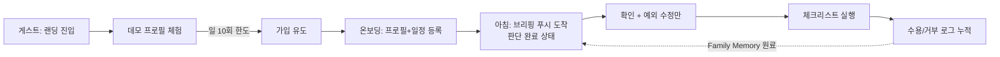

# 아이데이 (AiDay) — PRD

> **아이데이** — 오늘의 환경을 내 아이 기준으로 해석해, 부모의 하루 첫 육아 판단(옷차림·준비물·오늘의 케어 방식)을 대행하는 **데일리 케어 브리핑** AI

| 항목 | 내용 |
|------|------|
| **팀명** | 아이데이 (AiDay) |
| **작성일** | 2026-07-07 (v2.2 — 섹션 01~03 정비: 작성자 소개·Pain Point 재구성·통계 보강) |
| **문서 성격** | 프로토타입 v0.3 기준선 위에 쌓는 **고도화 PRD** — 6주 내 공개 베타 도달이 목표 |
| **라이브 데모** | https://aiday-demo.vercel.app |

> [!NOTE]
> **보조 문서 지도** — 이 PRD가 참조하는 원천 문서들:
>
> | 내용 | 문서 |
> |------|------|
> | 문제정의·페르소나 원본 | [docs/문제정의-프레임워크-v2.md](docs/문제정의-프레임워크-v2.md) |
> | 존재 이유·설계 원칙 | [MANIFESTO.md](MANIFESTO.md) |
> | 전체 화면 명세·구현 현황 | [SPEC.md](SPEC.md) |
> | 디자인 시스템 | [DESIGN.md](DESIGN.md) |
> | 성공 지표·출시 기준·제품 결정 | [docs/PRODUCT-DECISIONS.md](docs/PRODUCT-DECISIONS.md) |

**차례**

1. [작성자 소개](#01-작성자-소개)
2. [어떤 분야에 AI를 도입하려고 하는가](#02-어떤-분야에-ai를-도입하려고-하는가)
3. [현재 어떤 문제가 있는가](#03-현재-어떤-문제가-있는가)
4. [사용자는 누구인가](#04-사용자는-누구인가)
5. [문제 해결을 위한 기능](#05-문제-해결을-위한-기능)
6. [사용자 시나리오](#06-사용자-시나리오)
7. [화면 정의 ⭐](#07-화면-정의-)
8. [기술 요구사항 ⭐](#08-기술-요구사항-)
9. [데이터 확보 방안](#09-데이터-확보-방안)
10. [구현 방안 및 일정](#10-구현-방안-및-일정)
11. [성과 측정 방법 (KPI)](#11-성과-측정-방법-kpi)
12. [역할 분담](#12-역할-분담)

---

## 01. 작성자 소개

| 이름 | 역할 | 이메일 |
|------|------|--------|
| 이은상 | 기획·검수·의사결정 총괄 (1인 개발) | katherineeslee@gmail.com |
| Claude Code | AI 협업 도구 — 구현·코드 리뷰·QA 실행 ([섹션 12](#12-역할-분담) 참조) | — |

---

## 02. 어떤 분야에 AI를 도입하려고 하는가

부모가 매일 반복하는 육아 의사결정의 **첫 번째 판단 — 오늘의 환경 정보(날씨·미세먼지·꽃가루·자외선 등)를 내 아이 기준으로 해석해 옷차림·준비물·오늘 하루의 케어 방식을 결정하는 일** — 을 AI가 대행한다.

> 환경 해석에서 시작되는 **부모의 하루 첫 육아 판단 그 자체**를 지원한다.
> 외출·등원은 그 판단이 실행되는 대표적인 첫 육아 액션이다.
> (포지셔닝 원칙 전문: [docs/문제정의-프레임워크-v2.md](docs/문제정의-프레임워크-v2.md) — 기준 축)

---

## 03. 현재 어떤 문제가 있는가

### Pain Point — 정보는 넘치지만, 해석과 판단은 부모의 몫이다

부모의 하루 육아는 매일 아침 "오늘은 어떤 날인가, 그래서 내 아이에게 뭐가 필요한가"라는 판단에서 시작된다. 이 첫 판단은 출근·등원 준비가 겹치는 가장 바쁜 시간대에, 매일, 처음부터 다시 수행된다. 여러 앱에 파편화된 환경 정보를 수집하고 이를 아이의 체질·일정과 결합해 결론을 내리는 — **이 정보 수집과 의사결정 행위 자체가 바쁜 맞벌이 부모에게는 지속적인 인지 부담(Cognitive Load)이다.**

대표 시나리오([섹션 04](#04-사용자는-누구인가) 페르소나): 판단에 필요한 입력은 4개 축(시간대별 환경 궤적 / 아이 체질 / 아이의 오늘 일정 / 케어 옵션)이지만, 바쁜 아침에는 가장 접근하기 쉬운 입력값(현재 날씨) 하나로 판단이 축소된다 — 4개 축을 머릿속에서 결합할 인지 여력이 없기 때문이다. 문제는 부모의 노력 부족이 아니라, **이 판단이 통째로 부모의 머릿속에서만, 불완전한 입력값으로 이루어지는 구조**다.

### 기존 대안의 한계

| 기존 대안 | 한계 |
|-----------|------|
| 환경정보 앱 (기상청·미세미세 등) | 시간대별 예보가 '존재'하지만 아이의 일정·체질과 '결합'해 주지 않음 — 해석은 부모 몫 |
| 신생아 앱 (기록 중심) | 만 2세 이후 효용 급감. 유아기 이후 부모의 매일의 Job은 기록이 아니라 **판단** |
| 육아 커뮤니티 (맘카페 등) | 실시간성·신뢰도 낮음, 내 아이 상황과 다름 |
| 생성형 AI (챗지피티·클로드) | 매번 아이 상황을 재설명해야 함 |

### 문제의 규모

- **육아 환경의 구조적 변화:** 만 18세 미만 자녀를 둔 맞벌이 가구 비율 **58.5%**, 막내 자녀가 6세 이하인 맞벌이 가구는 **53.2%**('15년 대비 15.1%p 증가) (성평등가족부, 2025)
- **환경 리스크의 일상화:** 환경부 연구(2023)에 따르면 영유아기 미세먼지(PM2.5) 장기 노출은 소아 호흡기 감염 및 아토피 피부염 증가와 유의미한 상관관계를 보이며, 국내 소아 아토피 유병률은 최대 **20%**에 달한다. 영유아는 대표적인 환경 건강취약계층이다
- **사용자 검증 유저 인터뷰(만 1~8세 부모):** **76.4%**가 아침 등원 준비 시 옷차림 결정에 어려움을 겪고 있으며, 미세먼지로 인한 야외활동 낭패 경험도 **76.4%**. **88.2%**는 매일 환경 정보를 탐색하면서도 "파편화된 정보를 아이 기준으로 해석하는 과정 자체"를 최대 부담으로 꼽았고, 옷차림 결정이 어려운 상황 1위는 **"일교차가 큰 환절기"(82.4%)**
- 향후 사용 의향 **89%**, 최고 수요 기능은 당일 아침 자동 알림(**76.5%**)

### 근본 원인 (5 Why 추적 결과)

**매일 새로 발생하는 '하루의 첫 육아 판단'을 내 아이 기준으로 수행해 줄 구조의 부재.** 어떤 서비스도 내 아이(체질·일정·이력)를 모르고, 환경 데이터와 결합해 추론하는 구조가 시장에 없다.

본 PRD의 기능은 이 원인 사슬을 역순으로 끊는다: 자녀 프로파일·생활패턴 등록 → 시간대별 환경×일정 통합 브리핑 → 매일 선제 알림 → **"판단은 끝나 있고, 부모는 확인만 하는 아침"**.

---

## 04. 사용자는 누구인가

> [!NOTE]
> 대표 페르소나 "김서연"은 사용자 검증 유저 인터뷰의 응답 패턴(옷차림 결정 어려움 76.4%, 일교차 어려움 82.4%, 해석 부담 88.2%)과 실사용 시나리오를 결합해 구성했으며, **판단 엔진의 표준 테스트 케이스**([섹션 05](#05-문제-해결을-위한-기능)·[11](#11-성과-측정-방법-kpi))로도 사용한다.

| 항목 | 내용 |
|------|------|
| **이름** | 김서연, 30대 중반 맞벌이 직장인 여성 (배우자 맞벌이, 만 4세 자녀 "지우") |
| **자녀 특성** | **땀이 많은 체질**, 활동량 많음, 어린이집 재원 중 |
| **자녀 일정** | 등원 8:30 / 어린이집 산책 11:00~12:00 / 하원 17:00 |
| **일과·정보 습관** | 07:00 기상, 출근+등원 준비 동시 수행. 날씨 앱에서 '현재 기온'만 확인(시간대별 예보를 뜯어볼 인지 여력 없음) → 그 하나의 입력값으로 판단 → 실패 시(땀 젖음·추위) 강한 죄책감 |
| **지불 의사** | 사용자 검증 유저 인터뷰 기준 사용 의향 89%, 최고 수요 기능 "당일 아침 자동 알림"(76.5%). 유료 전환 의사는 미검증 — 공개 베타는 무료 운영, 리텐션 검증 우선. 사용 빈도는 매일 아침 1회 이상 (비외출일 포함) |

**하려는 일 (JTBD):**

- **기능적 Job** — "오늘 하루 내 아이를 어떻게 케어할지, 하루의 첫 판단을 빠르고 정확하게 끝내고 싶다." 정보 확인이 아니라 **판단의 완료**가 Job이며, '정확함'의 기준은 지금이 아니라 **오늘 하루 전체**
- **감정적 Job** — "내가 뭘 놓쳐서 아이가 고생하는 일이 없기를"
- **사회적 Job** — "바쁘지만 아이를 세심하게 챙기는 부모이고 싶다"

---

## 05. 문제 해결을 위한 기능

> [!NOTE]
> **기준선(이미 구현 완료, v0.3):** 이메일·Google 로그인 / 온보딩 7단계(아이 프로필·일과·알림 설정 → Supabase DB 저장) / 홈 AI 리포트(Claude Haiku 실연동) / 환경정보 4종 실데이터(기상청·에어코리아·꽃가루·자외선) / 규칙 기반 옷차림 추천 / 근거 기반 건강팁.
> 아래 P0는 이 기준선 위에 쌓는 고도화 범위다.

**P0 한눈에 보기:**

| # | P0 블록 | 핵심 |
|---|---------|------|
| 1 | 데일리 케어 브리핑 판단 엔진 | 판단 입력 4축, 환경 궤적×일정 교차 평가, 비외출일 브리핑, 표준 테스트 케이스 |
| 2 | 안전·비용 보호 레이어 | 규칙 기반 안전 판정 선행, 표현 안전 필터, 레이트리밋, Fallback Chain |
| 3 | 신뢰성 정합 | 프로필 포맷 정규화·매칭 버그 수정, 예시 뱃지, 더미 숨김, 약관·처리방침 |
| 4 | 선제 브리핑 발송 | PWA + 웹 푸시 2종(당일 아침·전날 밤) + 카카오톡 나에게 보내기 |
| 5 | PostHog 계측 | KPI 측정 기반 + 수용/거부 로그(Family Memory 원료) |

### P0 — 데일리 케어 브리핑 판단 엔진 (핵심)

판단의 입력은 4개 축이다. 판단 기준 시점은 '현재'가 아니라 **'오늘 하루 전체'**다.

| 축 | 입력 | 본 PRD 범위 |
|----|------|-------------|
| ① | **시간대별 환경 궤적** (기온·일교차·미세먼지·꽃가루·자외선·습도) | ✅ 판단·UI에 연결 |
| ② | **아이 프로파일** (연령·체질·건강상태) | ✅ 정규화 후 판단 반영 |
| ③ | **아이의 오늘 일정** (등원·산책·하원 등) | ✅ ①과 교차 평가 |
| ④ | **Family Memory** (과거 수용/거부 이력) | ⏸ 엔진 제외 — 원료가 되는 피드백 로그 수집만 시작 |

- **①×③ 교차점 평가:** 등원·산책·하원 등 각 일정 시각의 예보값을 명시적으로 평가하고 일교차 리스크를 산출하도록 리포트 프롬프트를 CoT 단계(환경 궤적 → 일정 교차 → 체질 리스크 → 우선순위 → 액션)로 재설계
- **체질 → 리스크 시나리오 추론:** '땀 많음' 같은 체질 태그가 리스크 사슬(땀 → 젖은 옷 → 체온 급강하)로 연결되는 추론 규칙을 프롬프트에 명시
- **실행 가능한 액션 단위 출력:** "겹쳐 입히세요"가 아니라 [얇은 반팔+겉옷 / 여벌 티셔츠 1장 / 알림장 문구]처럼 즉시 실행 가능한 체크리스트 (기존 checklist 형식 유지·강화)
- **비외출일 브리핑:** 일정이 없는 날(주말·우천·방학)에도 실내 케어 가이드(실내 습도·환기 시점·피부 케어)를 제공 — 빈 브리핑 금지
- **판단 근거의 가시화:** 홈 "시간대별 환경"·종합솔루션을 `/api/weather`의 `hourlyForecast` 실데이터로 연동(목데이터 제거) — 브리핑이 평가한 교차점을 사용자도 확인 가능하게
- **표준 테스트 케이스 상시 회귀:** 아래 서연 케이스를 판단 엔진 변경 시마다 통과 확인

**수락 기준:**

| Given | When | Then |
|-------|------|------|
| **[표준 테스트 케이스]** 만 4세·땀 많은 체질, 일정 등원 08:30/산책 11~12시/하원 17:00, 예보 20°→28°→17° | 브리핑 생성 | 출력에 **[겹쳐 입기(레이어드)] + [여벌 옷] + [땀 케어 포인트]**가 모두 포함된다 |
| 오늘 일정이 등록된 아이 | 브리핑 생성 | 각 일정 시각의 예보값이 판단에 반영되며 홈 시간대별 환경 카드의 값과 일치한다 |
| 일정이 비어 있고 주말·우천 예보 | 브리핑 생성 | 실내 케어 가이드가 포함된 유효한 브리핑이 생성된다 |

### P0 — 안전·비용 보호 레이어

- **규칙 기반 안전 레이어 분리:** 한파·폭염·미세먼지 경보 등 절대 안전 기준은 LLM 추론에 맡기지 않고 코드 레벨 규칙으로 선행 판정, LLM은 개인화 해석에만 사용
- **표현 안전 필터:** "감기를 예방해 준다" 등 건강 결과를 약속하는 표현을 프롬프트 금지 규칙 + 출력 후처리 검사로 차단(기존 의료 표현 금지 규칙 확장). 가치 서술은 "판단을 대신해 주고, 놓침을 줄여 준다"로 한정
- **`/api/report` 레이트리밋:** 비로그인(게스트) IP당 일 10회, 초과 시 429 + 안내 + 규칙 기반 기본 추천으로 전환
- **Fallback Chain 정비:** 외부 API 장애·LLM 파싱 실패 시에도 사용자는 항상 규칙 기반 기본 추천을 받는다 (빈 화면 금지)

**수락 기준:**

| Given | When | Then |
|-------|------|------|
| 게스트 IP가 당일 `/api/report`를 10회 호출한 상태 | 11번째 호출 | HTTP 429와 함께 홈에 체험 한도 안내 + 규칙 기반 기본 추천이 표시된다 |
| 초미세먼지 '매우나쁨' 실측값 | 브리핑 생성 | LLM 응답과 무관하게 "야외활동 자제" 규칙 판정이 체크리스트 최상단에 강제 포함된다 |
| LLM 출력에 건강 결과 약속 표현("감기 예방" 등) 포함 | 출력 후처리 | 해당 표현이 차단되고 규칙 기반 대체 문구로 전환된다 |
| Claude API 타임아웃 | 홈 진입 | "기본 추천" 라벨과 함께 규칙 기반 리포트가 3초 이내 표시된다 |

### P0 — 신뢰성 정합 (출시 Blocker 해소)

- **프로필 값 포맷 정규화:** 저장은 코드값으로 통일, 표시는 매핑 테이블로 일원화 + 특이사항 매칭 버그(완전일치 비교) 수정 — 판단 입력 축 ②가 실프로필에서 실제 작동하게 함
- **localStorage 네임스페이스 `aiday:` 통일** (구키 1회성 마이그레이션)
- **데모 프로필 "예시" 뱃지 표시,** 첫 실프로필 등록 시 데모 제거
- **홈 "추천 아이템"(더미 쇼핑 카드) 섹션 숨김**
- **이용약관·개인정보처리방침 실문서 게시** (아동 건강정보 수집 근거·보존 기간·삭제 정책 포함)

**수락 기준:**

| Given | When | Then |
|-------|------|------|
| 온보딩에서 "호흡기 민감 (비염, 천식·기관지)" 선택으로 등록한 실프로필 | 옷차림 페이지 진입 | 악세사리에 KF94 마스크가 추천된다 (현재는 데모 프로필에서만 작동) |
| 랜딩 푸터의 개인정보처리방침 링크 클릭 | 페이지 이동 | `href="#"`이 아닌 실문서 페이지가 열린다 |

### P0 — 선제 브리핑 발송: 웹 푸시 2종 + 카카오톡 (PWA)

> [!IMPORTANT]
> 프로세스 재정의의 핵심: "부모가 묻고 AI가 답한다" → **"AI가 먼저 제안하고 부모가 승인한다"**. 선제적 육아 어드바이스라는 서비스 본질은 선제적 알림 없이는 전달되지 않는다 — 따라서 알림은 부가 기능이 아니라 **P0 필수 기술 요소**다 (2026-07-07 확정).
> 채널을 이중화하는 근거: iOS의 웹 푸시는 PWA를 홈 화면에 설치해야만 작동하므로, 웹 푸시 단독으로는 아이폰 사용자 상당수에게 "먼저 알려주는" 약속이 도달하지 않는다. 카카오톡 채널이 이 도달 공백을 보완한다.

- **PWA 전환:** manifest + Service Worker ("홈 화면에 추가" 설치 경험)
- **웹 푸시 구독:** 알림 설정 화면([S-002](#화면-s-002-알림-설정-신설--마이페이지-하위))에서 권한 요청 → 구독 정보 DB 저장
- **당일 아침 브리핑 발송:** 온보딩 설정(등원 N분 전, 기본 30분 전 — 미설정 시 07:10)에 당일 예보 기반 브리핑 요약을 발송. Vercel Cron 10분 폴링 + 발송 이력 테이블로 중복 방지
- **전날 밤 준비 알림 발송:** 설정 시각(기본 21:00)에 익일 예보 기반 준비물 요약(여벌 옷·가방 챙기기 등)을 발송 — 준비물은 전날 밤에 챙기는 실사용 흐름 지원. 아침 브리핑과 동일한 Cron·이력 인프라(발송 type만 추가)
- **카카오톡 "나에게 보내기" 채널:** 카카오 로그인(Supabase Kakao OAuth) 도입 + `talk_message` 권한으로 브리핑을 본인 카카오톡으로 발송. 온보딩·알림 설정의 "카카오톡 알림 연동" 버튼 실동작화. 웹 푸시 구독과 카톡 연동은 독립 — 둘 다 켜면 양쪽으로 수신

**수락 기준:**

| Given | When | Then |
|-------|------|------|
| 알림 ON(등원 08:30, 30분 전 설정) + 푸시 구독 완료 사용자 | 08:00 도래 | ±10분 내 당일 브리핑 푸시가 도착한다 |
| 전날 밤 알림 ON(21:00) 사용자 | 21:00 도래 | ±10분 내 익일 준비물 알림이 도착한다 |
| 카카오 연동 완료 + 웹 푸시 미구독 사용자 | 발송 시각 도래 | 브리핑이 카카오톡 "나에게 보내기"로 도착한다 |
| 카카오 액세스 토큰 만료 | 발송 시각 도래 | 리프레시 토큰으로 갱신 후 발송, 갱신 실패 시 웹 푸시로 폴백하고 실패 사유가 기록된다 |
| 알림 OFF 사용자 | 발송 시각 도래 | 발송되지 않는다 |
| 같은 날 같은 종류가 이미 발송된 사용자 | Cron 재실행 | 중복 발송되지 않는다 |
| 예보 조회 실패 | 발송 시각 도래 | 해당 회차는 발송 스킵(잘못된 정보 발송 금지)되고 실패 사유가 기록된다 |

### P0 — PostHog 계측 연동 (KPI 측정 기반)

- **이벤트 계측:** 가입 완료 / 온보딩 단계별 진입·완료 / 브리핑 노출(`briefing_viewed`) / **체크리스트 액션별 체크·해제(`action_accepted`/`action_dismissed`)** — 추천 수용률 측정이자 Family Memory의 학습 원료 / 푸시 수신·클릭 / 브리핑 확인 후 환경정보 상세 재탐색 여부(판단 대체율 프록시)
- [섹션 11](#11-성과-측정-방법-kpi) KPI 전 지표가 대시보드에서 숫자로 확인 가능한 상태를 만든다

**수락 기준:**

| Given | When | Then |
|-------|------|------|
| 신규 사용자가 가입 → 온보딩 완료 → 브리핑 확인 → 체크 1회 | PostHog 조회 | 4개 이벤트가 해당 사용자로 기록되어 있다 |

### P1 — 있으면 좋음 (P0 조기 완료 시에만 착수)

- **래퍼앱 (WebView/Capacitor):** 기존 웹앱을 감싸 앱스토어·플레이스토어에 배포하고 **네이티브 푸시(FCM/APNs)**를 확보 — iOS 웹 푸시의 "홈 화면 설치 필수" 제약을 근본 해소하는 다음 단계. 개발자 계정·스토어 심사 리드타임이 있어 6주 P0에는 넣지 않는다 (앱 형태 단계화 결정: [docs/PRODUCT-DECISIONS.md](docs/PRODUCT-DECISIONS.md) §3-5)
- Eval Pipeline: 브리핑 출력 자동 평가(금지 표현·길이·스키마 + 표준 테스트 케이스 자동 실행) 및 품질 하락 시 배포 차단

### P2 — 제외 (Non-Goals)

- 의료 진단·처방 기능, 건강 결과를 약속하는 표현 (일반 건강 정보 + 면책 고지 유지)
- 쇼핑·커머스 연동 (추천 아이템 카드는 오히려 숨김 처리)
- 육아 커뮤니티·피드, 신생아 트래킹(수유·수면 기록)
- 카카오 알림톡(비즈메시지) — 발신프로필·템플릿 승인 리드타임이 6주 초과, 공개 베타 검증 후 착수 (P0의 카카오톡 "나에게 보내기"와 별개 채널)
- **Family Memory Engine**(수용/거부 이력의 판단 반영·개인화 학습) — OverEdge 장기 로드맵. 단, 그 원료인 액션별 수용/거부 로그 수집은 이번 범위(P0 계측)에서 시작한다
- 네이티브 앱 재개발(React Native/Flutter 등) — 앱 형태는 단계적으로 전환한다: **PWA(P0) → 래퍼앱(P1) → 네이티브 재개발(공개 베타 검증 후 별도 결정)**. 이번 범위에서 제외되는 것은 마지막 단계뿐이다

---

## 06. 사용자 시나리오

### Before — 아이데이가 없는 서연의 하루 (실패 시나리오)

| 시각 | 상황 |
|------|------|
| 07:00~08:20 | 출근+등원 준비 동시 수행. 날씨 앱에서 **현재 기온 20°만** 확인 |
| 08:20 | 확인한 정보 기준으로 합리적 선택: 면 티셔츠 + 긴 바지 (시간대별 예보·일교차는 확인 못 함) |
| 11:00~12:00 | 어린이집 산책, **기온 28°** — 땀 많은 지우, 땀에 흠뻑 젖음. 여벌 옷 없음 |
| 17:00 | 하원, **기온 17° (일교차 11°)** — 젖은 옷 상태로 추위에 떪 |
| 저녁 | 지우 컨디션 저하. 서연: "내가 꼼꼼히 못 챙겨서…" **죄책감** |

### After — 아이데이가 있는 같은 하루

| 시각 | 상황 |
|------|------|
| 07:10 (기상 직후) | 아침 브리핑 푸시 도착 — **판단이 이미 완료된 채로**: "오늘은 일교차가 큰 날이에요(등원 20° → 산책 28° → 하원 17°). 지우는 땀이 많은 체질이라 특히 주의가 필요해요" + ☑ 얇은 반팔+가벼운 겉옷 ☑ 여벌 티셔츠 1장(가방에) ☑ 알림장 한 줄: "산책 후 옷 갈아입혀 주세요" |
| 08:20 | 서연은 **확인 + 실행만** (1분) — 체크리스트를 체크하며 준비 |
| 11~12시 / 17:00 | 산책 때 겉옷 벗김, 산책 후 여벌 옷 교체 / 겉옷 착용, 마른 옷으로 하원 |
| 저녁 | 지우 컨디션 양호. 서연: "챙겨줬다"는 안도감 → 체크 로그가 수용 이력으로 누적 |

**비외출일(주말·우천):** 일정이 없어도 브리핑 도착 — "오늘은 실내 놀이가 좋겠어요. 실내 습도 40% 아래로 건조해요 — 가습과 보습제, 환기는 미세먼지 낮은 오전 중으로"

**게스트 신규 방문:** 랜딩 → "먼저 둘러볼게요" → 데모 프로필("예시" 뱃지) 체험 → 일 10회 한도 도달 시 가입 유도 → 가입 시 localStorage 프로필 DB 이전



---

## 07. 화면 정의 ⭐

> [!NOTE]
> 기준선 화면 전체 명세는 [SPEC.md](SPEC.md) 참조(보조). 아래는 본 PRD 범위에서 **변경·신설되는 화면**의 실행 가능한 정의다.

### 화면 S-001: 홈 — 데일리 케어 브리핑 (변경)

**목적:** 아침 5초 안에 오늘 내 아이에게 필요한 판단(옷차림·준비물·케어 방식)의 결론을 파악하고, 확인·실행만 남기는 서비스 핵심 화면

```text
+------------------------------------+
| AiDay 아이데이        🔔  ⚙️        |
+------------------------------------+
| [👧 지우 6세] [도윤 2세 (예시)] [+] |   ← 데모 프로필에 "예시" 뱃지
+------------------------------------+
| AI REPORT · 7월 7일 (화)           |
| ● 오늘은 주의가 필요해요            |
| 일교차 11° — 겹쳐 입기 필수         |   ← 하루 전체 궤적 기준 hook
| (message: 일정 교차 기반 해석 —     |
|  "산책 28° 땀 주의, 하원 17° 겉옷") |
| [미세먼지·보통][꽃가루·높음]...     |
| ☐ 👕 얇은 반팔+겉옷                |   ← 실행 가능한 액션 단위
| ☐ 🎒 여벌 티셔츠 1장               |
| ☐ 📝 알림장: 산책 후 옷 교체       |
+------------------------------------+
| 시간대별 환경  →                    |   ← hourlyForecast 실데이터.
| [등원 08:30] [산책 11:00] [하원17:00]|     아이 일정 시각과 정렬 —
| [ ⛅ 20°   ] [ ☀️ 28°   ] [ 🌥 17° ]|     판단 근거의 가시화
+------------------------------------+
| 지우를 위한 오늘의 종합 솔루션      |   ← 실데이터 기반 판정으로 전환
+------------------------------------+
| (추천 아이템 섹션 — 제거됨)         |   ← 더미 쇼핑 카드 숨김
+------------------------------------+
| 홈 | 환경정보 | 옷차림 | 건강팁 | 마이 |
+------------------------------------+
```

| 상태 | 정의 |
|------|------|
| **동작** | 체크리스트 항목 체크/해제 → PostHog `action_accepted`/`action_dismissed` (액션별). 아이 탭 전환 → 해당 아이 기준 브리핑 재조회(5분 캐시) |
| **빈 상태** | 프로필 없음 → 데모 프로필 2개("예시" 뱃지) 자동 표시. **일정 없는 날 → 실내 케어 브리핑 표시 (빈 브리핑 금지)** |
| **에러 — 레이트리밋(429)** | 브리핑 카드 위치에 "오늘의 체험 횟수를 모두 사용했어요. 가입하면 계속 이용할 수 있어요 → [무료로 시작하기]" + 규칙 기반 기본 추천 |
| **에러 — Claude API 장애** | "기본 추천" 라벨 + 규칙 기반 리포트 (기존 fallback 유지) |
| **에러 — 날씨 API 장애** | 상단 배너 "환경 데이터를 불러오지 못했어요. 잠시 후 다시 시도해주세요" |

### 화면 S-002: 알림 설정 (신설 — 마이페이지 하위)

**목적:** 웹 푸시 권한 획득과 아침 브리핑 발송 시각 설정 (현재 "준비 중" 토스트를 실화면으로 대체)

```text
+------------------------------------+
| ← 알림 설정                         |
+------------------------------------+
| 푸시 알림                           |
| 브라우저 알림을 허용하면 매일 아침  |
| 판단이 끝난 브리핑을 먼저 받아요    |
| [ 알림 허용하기 ]                   |
+------------------------------------+
| 🌅 당일 아침 브리핑      [ON  ⭘—]  |
|    발송 기준   [등원 30분 전 ∨]    |
|    (일정 미등록 시)  [07:10 ∨]     |
+------------------------------------+
| 🌙 전날 밤 준비 알림     [ON  ⭘—]  |
|    발송 시각            [21:00 ∨]  |
+------------------------------------+
| 💬 카카오톡으로도 받기   [연동하기] |
+------------------------------------+
```

| 상태 | 정의 |
|------|------|
| **동작** | [알림 허용하기] → 브라우저 권한 프롬프트 → 허용 시 푸시 구독 생성·DB 저장 → "알림 켜짐 ✓" 전환. 발송 기준·시각 변경 → `children.notif` 즉시 갱신. [연동하기] → 카카오 로그인 + `talk_message` 동의 → 연동 완료 시 "카카오톡 연동됨 ✓" 표시 |
| **빈 상태** | 권한 미요청 → 안내 문구 + [알림 허용하기] 버튼 |
| **에러 — 권한 거부** | "브라우저 설정에서 알림을 허용해주세요" + 브라우저별 설정 경로 안내 |
| **에러 — iOS Safari 미설치** | "홈 화면에 추가하면 알림을 받을 수 있어요" PWA 설치 안내 + "또는 카카오톡으로 받기" 대안 제시 |
| **에러 — 카카오 동의 거부** | "카카오톡 메시지 권한에 동의해야 알림을 보낼 수 있어요" 안내, 연동 미완료 상태 유지 |

### 화면 S-003: 당일 아침 브리핑 푸시 (신설 — OS 알림 UI)

**목적:** 부모가 기상했을 때 판단이 이미 완료된 채 도착해 있는 상태의 구현 — "AI가 먼저 제안하고 부모가 승인한다"

```text
+------------------------------------+
| AiDay 아이데이            07:10    |
| 오늘은 일교차가 큰 날이에요         |
| 등원 20° → 산책 28° → 하원 17°.    |
| 지우 얇은 반팔+겉옷, 여벌 티셔츠    |
| 챙겨주세요                          |
+------------------------------------+
```

| 상태 | 정의 |
|------|------|
| **동작** | 탭 → `/home` 진입(브리핑 상세) + PostHog `push_clicked` |
| **내용 규칙** | 제목은 브리핑 hook 형식(25자 이내), 본문은 당일 예보×일정 교차 기반 핵심 액션 1~2개. 건강 결과 약속 표현 금지(표현 안전 필터 적용). 전날 밤 준비 알림·카카오톡 발송도 동일 형식(전날 밤은 익일 예보 기반 준비물 중심) |
| **에러 — 예보 조회 실패** | 해당 회차 발송 스킵(잘못된 정보 발송 금지), 발송 이력에 실패 사유 기록 |

### 화면 S-004: 이용약관·개인정보처리방침 (신설 — 정적 페이지)

**목적:** 아동 건강정보(민감정보) 수집의 법적 근거 게시. 랜딩 푸터·가입 화면의 `href="#"` 링크를 실문서로 연결

| 항목 | 정의 |
|------|------|
| **구성** | 수집 항목(아이 이름·생년월일·건강 특이사항·일정 등) · 수집 근거 · 보존 기간 · 삭제 정책(회원 탈퇴 시 연쇄 삭제) · 문의처 |
| **동작** | 가입 화면 [필수] 동의 체크박스 → 본 문서 링크 |
| **빈 상태 / 에러 상태** | 해당 없음 (정적 문서) |

---

## 08. 기술 요구사항 ⭐

### 기술 스택

| 영역 | 선택 |
|------|------|
| 언어 | TypeScript 5.8 |
| 프레임워크 | Next.js 15 (App Router) + React 18 |
| DB·인증 | Supabase (PostgreSQL + Auth, RLS 적용) |
| 프론트 | Tailwind CSS 3 + shadcn/ui (Radix), 모바일 우선 390px 고정 프레임 |
| LLM | Claude Haiku (`claude-haiku-4-5`, @anthropic-ai/sdk) — 브리핑 생성 |
| 배포 | Vercel (라이브: https://aiday-demo.vercel.app) |
| **신규 도입** | web-push(VAPID) + Service Worker — 푸시 발송 / Vercel Cron — 발송 스케줄러(10분 폴링) / **카카오 로그인(Supabase Kakao OAuth) + Kakao `talk_message` API** — 카톡 발송 채널 / PostHog — 제품 계측 / 레이트리밋 카운터 — Supabase 테이블 기반(별도 인프라 추가 없음) |
| 버전 관리 | Git + GitHub (main 직접 푸시 금지, feature 브랜치 → PR) |

### 판단 엔진 명세 (프롬프트 아키텍처)

- **입력 4축:** ① `hourlyForecast`(시간대별 예보 — 이미 `/api/weather`가 제공) ② `children` 프로필(체질·민감도) ③ `children.schedule`(등원·야외활동·하원 시각) ④ (수집만) 액션별 수용/거부 로그
- **CoT 추론 단계 (프롬프트에 명시):** 환경 궤적 평가 → 일정 시각별 교차점 평가(등원·산책·하원 각각) → 체질 리스크 사슬 도출 → 위험 우선순위 → 실행 가능 액션 3~4개
- **선행 규칙 레이어:** 절대 안전 기준(경보 임계값)은 `lib/safety-rules.ts`에서 LLM 호출 전 판정, 결과를 체크리스트에 강제 병합
- **후행 표현 필터:** 건강 결과 약속·의학적 표현 검사 → 위반 시 규칙 기반 문구로 대체
- **표준 테스트 케이스:** 서연 케이스(입력: 만 4세·땀 많음·등원 8:30/산책 11~12/하원 17, 예보 20°→28°→17° / 기대 출력: 겹쳐 입기+여벌 옷+땀 케어)를 고정 입력 스크립트로 작성, 판단 엔진 변경 PR마다 실행

### 데이터 모델 (신규 테이블)

| 테이블 | 컬럼 | 용도 |
|--------|------|------|
| `push_subscriptions` | user_id, endpoint, keys(p256dh·auth), created_at | 푸시 구독 저장 (RLS: 본인만) |
| `notifications_log` | user_id, child_id, type(morning·night), channel(webpush·kakao), scheduled_for, sent_at, status, fail_reason | 중복 발송 방지의 근거 테이블 |
| `kakao_tokens` | user_id, refresh_token(암호화 저장), expires_at | 카톡 발송용 토큰 보관 — Cron이 발송 시 액세스 토큰 갱신에 사용 (RLS: 본인 + service role) |
| `report_rate_limits` | ip_hash, date, count | 게스트 일 10회 판정 |

기존 `children.notif`(json)를 발송 설정 원본으로 사용(온보딩 Step 7에서 이미 수집 중), `children.schedule`(json)을 판단 입력 축 ③으로 사용.

### 비기능 요구사항

- 브리핑 생성 응답 p95 ≤ 10초 (Claude 호출 포함), 실패 시 규칙 기반 fallback 3초 이내 표시
- 환경 API 프록시 응답 p95 ≤ 1,500ms (서버 캐시: 날씨 30분·대기질 1시간·꽃가루 6시간 유지)
- 알림 정시 도달률(전 종류·전 채널, 설정 시각 ±10분) ≥ 95%
- LLM 비용 월 ≤ 5만원 (레이트리밋 + 클라이언트 5분 캐시로 통제)
- `npm run build` · `npm run lint` 통과 + **표준 테스트 케이스 통과**가 판단 엔진 관련 PR의 머지 조건 (범용 테스트 스위트는 현재 없음 — 검증은 dev 서버 실구동 + QA 스킬)
- 브라우저: 모바일 Chrome·Safari(iOS는 PWA 설치 시 푸시 지원), 데스크톱 Chrome·Edge
- 아동 건강정보는 민감정보로 취급 — RLS로 본인 외 접근 차단, 처리방침 게시(S-004), 오픈소스 라이선스만 사용

---

## 09. 데이터 확보 방안

| 항목 | 내용 |
|------|------|
| **필요한 데이터** | 시간대별 예보(판단 입력 축 ①의 핵심), 실시간 대기질(PM10·PM2.5·오존), 꽃가루·자외선 지수, 아이 프로필·일정(축 ②·③), 액션별 수용/거부 로그(축 ④의 원료) |
| **출처** | 기상청 단기예보 API(`KMA_API_KEY` — 날씨·자외선), 한국환경공단 에어코리아 API(`AIRKOREA_API_KEY`), 기상청 꽃가루 API(`POLLEN_API_KEY`) — **전부 공공 API로 이미 연동 완료·운영 중**. 프로필·일정은 온보딩에서 사용자 직접 입력(Supabase), 수용/거부 로그는 PostHog 이벤트로 수집 개시 |
| **난이도** | **하** — 신규 데이터 확보 없음. 본 PRD 범위는 이미 확보된 데이터(`hourlyForecast` 등 미활용 필드)를 판단 엔진·UI·알림에 연결하는 작업 |
| **알려진 제약** | 기상청 자외선 데이터는 KST 06시 발행(이전엔 전일 데이터 fallback), 꽃가루 API는 잡초(weed) 미제공(항상 null), 비정상 지역 파라미터는 서울 fallback — 외부 API 호출부는 전부 try/catch + 사용자 피드백 처리 |
| **저작권·개인정보** | 공공데이터 출처 표기(푸터 유지). 아동 건강정보는 민감정보 — 수집 근거·보존 기간·삭제 정책을 개인정보처리방침(S-004)으로 게시하고 RLS로 접근 통제 |

---

## 10. 구현 방안 및 일정

| Phase | 기간 | 목표 | 완료 조건 |
|-------|------|------|-----------|
| Phase 1 | 1주차 | 안전·비용 보호 레이어 | 게스트 11번째 호출 429 + 안내 표시 / 경보 규칙 판정이 LLM보다 선행 / 표현 필터 작동 / API 장애 시 fallback 3초 내 표시 |
| Phase 2 | 2주차 | 신뢰성 정합 — 프로필·저장소·법적 문서 | 온보딩 실프로필로 옷차림 마스크·보습 추천 작동 / `aiday:` 통일 + 구키 마이그레이션 / 예시 뱃지·추천 아이템 숨김 / 약관·처리방침 실문서 링크 연결 |
| **Phase 3** | 3주차 | **판단 엔진 고도화 (핵심)** | **표준 테스트 케이스(서연) 통과** / 일정 시각별 예보 교차 평가 반영 / 비외출일 실내 케어 브리핑 생성 / 홈 시간대별 카드 hourlyForecast 실측값 표시 |
| Phase 4 | 4주차 | 선제 알림 인프라 (PWA + 웹 푸시 2종) | S-002에서 구독 성공 / 아침·전날 밤 알림 ±10분 내 도달 / OFF 사용자 미발송 / 중복 발송 없음 / 예보 실패 시 발송 스킵 |
| Phase 5 | 5주차 | 카카오톡 채널 (로그인 + 나에게 보내기) | 카카오 연동 → 브리핑이 카톡으로 도달 / 토큰 갱신·웹 푸시 폴백 작동 / 온보딩 연동 버튼 실동작 |
| Phase 6 | 6주차 | PostHog 계측 + QA·공개 베타 | KPI 이벤트 대시보드 확인(수용/거부 로그 포함) / QA 스킬 전체 화면 점검 통과 / build·lint·표준 케이스 통과 / 공개 링크 배포 |

> [!WARNING]
> **일정 컨틴전시:** 6주에 P0 6블록은 여유가 없는 일정이다. Phase 5(카카오 채널)가 지연될 경우, 공개 베타는 웹 푸시만으로 개시하고 카카오 채널을 베타 직후 첫 fast-follow로 이월한다 — 카카오 채널 지연이 베타 공개 자체를 막지는 않는다.

각 Phase는 5~15분 작업량의 Task들로 구성한다. 예시 (Phase 3 — 판단 엔진):

- [ ] `lib/prompts/report.ts`에 CoT 추론 단계(궤적→교차→리스크→우선순위→액션) 명시
- [ ] 일정 시각(`schedule`)과 `hourlyForecast` 슬롯 매핑 함수 정비 — 산책·하원 시각 보간
- [ ] 체질 리스크 사슬 few-shot 추가 (땀 많음 × 일교차 케이스 — 서연 시나리오 기반)
- [ ] 비외출일(일정 없음) 분기 프롬프트 + 실내 케어 few-shot 추가
- [ ] 표준 테스트 케이스 고정 입력 스크립트(`scripts/eval-briefing.ts`) 작성·실행
- [ ] 홈 시간대별 카드를 `weather-mock.ts` → `hourlyForecast` 실데이터로 교체
- [ ] 캐시 키 버전 상향 (브리핑 스키마 변경 시 — CLAUDE.md 캐시 컨벤션)

(이하 Phase별 Task 상세는 착수 시점에 `@PRD.md의 10 구현 방안`을 참조해 Phase 단위로 분해·실행한다)

---

## 11. 성과 측정 방법 (KPI)

> [!IMPORTANT]
> 측정 대상은 "외출 준비가 편해졌나"가 아니라 **"하루의 첫 육아 판단이 아이데이로 대체되었나"**이다.

### 제품 KPI (PostHog)

| KPI | 목표 값 | 검증하는 것 |
|-----|---------|-------------|
| **아침 재방문율 ⭐ 북극성** (첫 방문 후 14일 내 05~10시 KST 방문 3일 이상) | ≥ 30% | '매일의 첫 판단'이라는 Job 정의의 실증 |
| 온보딩 완료율 (가입 → 7단계 완료) | ≥ 60% | 가치 제안이 프로필·일정 입력 수고를 넘어서는가 (진단: 낮으면 진입 문제) |
| 추천 수용률 (브리핑 노출 액션 중 체크된 비율) | ≥ 40% | 브리핑이 읽을거리가 아니라 행동 가이드로 쓰이는가 (진단: 낮으면 품질 문제). 로그는 Family Memory 학습 원료 겸용 |
| 판단 대체율 프록시 (브리핑 확인 세션 중 환경정보 상세 재탐색 없이 종료한 비율) | ≥ 60% (가설 목표 — 베이스라인 수집 후 보정) | 판단 대행이 실제로 작동하는가 |
| 외출 없는 날 리텐션 (주중 활성 사용자의 주말·우천일 방문 유지율) | ≥ 25% (가설 목표) | **"외출 앱이 아니라 데일리 케어 판단 앱"이라는 포지셔닝의 데이터 증명** |
| 알림 오픈율 (웹 푸시 클릭 + 카톡 링크 진입 합산, 발송 대비 24시간 내) | ≥ 40% | 선제 브리핑이 아침 진입점으로 작동하는가 |

### 기술 KPI

| KPI | 목표 값 | 측정 수단 |
|-----|---------|-----------|
| 표준 테스트 케이스(서연) 통과 | 100% (판단 엔진 PR마다) | `scripts/eval-briefing.ts` |
| 알림 정시 도달률 (전 종류·전 채널, ±10분) | ≥ 95% | `notifications_log` 집계 |
| 브리핑 JSON 파싱 성공률 | ≥ 97% | 서버 로그 집계 |
| 브리핑 생성 응답 p95 | ≤ 10초 | Vercel 로그 |
| LLM 월 비용 | ≤ 5만원 | Anthropic 콘솔 |
| `npm run build` · `npm run lint` 통과율 (머지된 PR 기준) | 100% | GitHub PR 이력 |

**운영 원칙:**

- 북극성은 **아침 재방문율**을 유지한다 ([docs/PRODUCT-DECISIONS.md](docs/PRODUCT-DECISIONS.md) §1). '판단 대체율'은 북극성 후보로서 프록시 지표로 측정을 시작하고, 베이스라인 확보 후 북극성 교체 여부를 결정한다.
- 제품 KPI 목표치 판정은 PostHog 연동(Phase 5) 이후 개시 — 수치 없는 감 판정 금지.
- 정성 지표(별도 수집): "브리핑 덕에 여벌 옷을 챙겨서 유용했다" 류의 **실패 회피 사례** — 베타 사용자 인터뷰로 수집.

---

## 12. 역할 분담

| 이름 | 담당 섹션 | 담당 기능 | Git 커밋 범위 |
|------|-----------|-----------|---------------|
| 이은상 | 01~04, 09, 11 (기획·지표) | 문제정의·페르소나 원본 작성([docs/문제정의-프레임워크-v2.md](docs/문제정의-프레임워크-v2.md)), 제품 결정·우선순위 확정, PR 리뷰·머지, 실기기 QA, 약관·처리방침 문안 검수, KPI 판정 | `docs/`, `*.md`, PR 승인·머지 권한 |
| Claude Code | 05~08, 10 (설계·구현) | P0 전 기능 구현, 판단 엔진 프롬프트 재설계, 코드 리뷰(/code-review)·QA(/qa) 실행, DB 마이그레이션 작성 | `app/`, `lib/`, `components/`, `supabase/`, `scripts/`, `public/` |

**협업 규칙:** 모든 변경은 feature 브랜치 → PR → 이은상 승인 후 머지 (main 직접 푸시 금지). AI가 작성한 PRD·코드·문서는 이은상이 최종 검토한다 — 특히 기술적 실현 가능성, 도메인 규칙(아동 건강정보·표현 안전), 범위 확장 여부.

---
