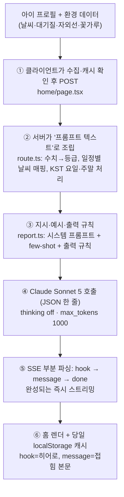
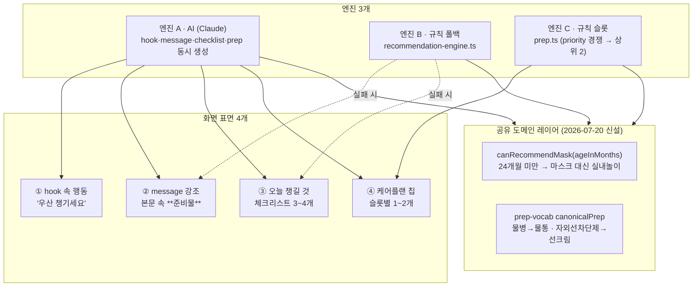

# 홈 AI 리포트 · 준비물 아키텍처

홈 화면의 **AI 리포트(hook·message)** 와 **준비물(체크리스트·케어 플랜 칩)** 이 만들어지는 경로를 한 문서로 정리한다. 2026-07-20 리포트 메시지 고도화 + 준비물 정합성 개선(R1~R3, 교차 체크) 작업의 산출물이다.

- 리포트 프롬프트: [`lib/prompts/report.ts`](../lib/prompts/report.ts)
- 리포트 API: [`app/api/report/route.ts`](../app/api/report/route.ts)
- 준비물 규칙 엔진: [`lib/prep.ts`](../lib/prep.ts) · [`lib/recommendation-engine.ts`](../lib/recommendation-engine.ts)
- 준비물 어휘 사전: [`lib/prep-vocab.ts`](../lib/prep-vocab.ts)
- 연령·체질 도메인: [`lib/domain/child-conditions.ts`](../lib/domain/child-conditions.ts)
- 홈 렌더링: [`app/(main)/home/page.tsx`](../app/(main)/home/page.tsx)
- 평가 하네스: [`scripts/eval-report.mjs`](../scripts/eval-report.mjs) · [`eval-personas.mjs`](../scripts/eval-personas.mjs) · [`eval-model-ab.mjs`](../scripts/eval-model-ab.mjs)

---

## Part 1 — hook / message 생성 파이프라인

`message`는 서버가 문장을 조립하는 게 아니라 **Claude가 생성한 JSON의 `message` 필드**다. 서버의 역할은 "좋은 입력을 만드는 것"과 "스트림에서 일찍 뽑아 내려보내는 것"이다.

### 단계별 설명

1. **재료 수집(클라이언트)** — 홈 진입 시 기상청·에어코리아·자외선·꽃가루를 각 프록시로 불러 ref에 담고, 이 데이터 + 활성 아이 프로필을 `/api/report`에 POST한다. 요청 전 **당일 캐시**를 먼저 보고, `envChanged`(비 유무·강수확률 30%p·PM10/PM2.5/통합대기·자외선·꽃가루 경계·기온 3°C·습도 20%p 변동), `profileSig` 불일치(같은 날 체질·민감도·일과 수정), 또는 `needsMorningRefresh`(새벽 잠정본→06시 이후 발표본)일 때만 재생성한다.
2. **프롬프트 조립(서버)** — 원시 데이터를 모델이 오해하지 않을 한국어 요약으로 가공한다. **수치 대신 등급만**(μg/m³·UVI 숫자 미포함), 일정별 날씨 매핑(3시간 해상도, 2시간 초과 이격 시 생략), 자외선 오귀속 방지(피크 시각 명시), KST 요일 + 주말엔 등원·하원 줄 제외.
3. **지시·예시(품질 규칙이 사는 곳)** — "육아 친구" 페르소나 + 금지 목록(일반 조언·억지 연결·무정보 안심 문장·2인칭), 상황별 few-shot, 출력 규칙(message 250자·문장마다 `\n`·`**단어**` 강조·이슈 1~2개·마스크 연령·우산 임계 등).
4. **생성·스트리밍(서버)** — `claude-sonnet-5`, thinking 비활성(저지연 우선). **부분 파싱**: 토큰이 쌓이는 동안 `"message":"..."`의 닫는 따옴표가 도착한 순간 그 필드만 뽑아 즉시 SSE로 내려보낸다. hook은 ~2초, message는 그 직후 노출.
5. **수신·렌더(클라이언트)** — `hook`→스켈레톤 해제·히어로, `message`→본문 state, `done`→체크리스트·캐시(`prep` 필드는 평가 하네스용 — 클라이언트는 소비하지 않는다). `aiMessage || fallbackMessage`로 실패 시 규칙 기반 폴백. **hook이 있으면 message는 접혀 있고** "자세히" 토글로 펼친다. 프로필 전환·중복 요청은 `isCurrent()`(세대 카운터 + childId)로 낡은 응답이 화면을 덮지 않게 막는다.

### 고도화 레버가 있는 지점

| 층 | 위치 | 바꾸면 달라지는 것 |
|---|---|---|
| 입력 가공 | route.ts 요약 로직 | 모델이 "아는" 사실의 범위·정확성 |
| 지시·예시 | report.ts | 톤·길이·강조·우선순위 판단 |
| 모델 설정 | route.ts 호출부 | 지연 vs 추론 깊이 |
| 신선도 | envSignature/profileSignature/morningRefresh | 하루 중 갱신 조건 |
| 표시 | page.tsx renderRich·접힘 | 같은 message가 읽히는 방식 |

> **검증**: 프롬프트 변경은 `scripts/eval-report.mjs`로 12개 대표 시나리오 before/after 대조가 필수다. 톤(페르소나) 변경은 `eval-personas.mjs` 베이크오프, 모델 변경은 `eval-model-ab.mjs`로 A/B 한다. 2026-07-20 페르소나 베이크오프 결과 현행 "육아 친구"(P0)가 후보 4종을 이겨 유지 결정.

---

## Part 2 — 준비물(아이템) 파이프라인

준비물이 화면에 닿는 **표면은 4개**, 그 뒤의 **엔진은 3개**다. 개선 전에는 표면마다 담당 엔진이 달라 어휘·안전 규칙이 어긋날 수 있었고, 2026-07-20 개선으로 **세 엔진이 공유하는 도메인 레이어**를 신설했다.

### 엔진별 역할

- **엔진 A (AI)** — 아침에 한 번, `{hook, message, checklist, prep}`를 **한 JSON으로 동시 생성**. 프롬프트 규칙이 아이템을 통제(마스크 연령·우산 임계·특이사항 접두어 금지 등). 당일 캐시에 4종이 함께 저장·복원.
- **엔진 B (규칙 폴백)** — AI 실패 시 기온/바람/미세먼지/건조/땀 규칙으로 체크리스트 + 폴백 문장 조립. 항목이 `"마스크 (꽃가루 높음)"`처럼 사유를 괄호로 갖는다.
- **엔진 C (규칙 슬롯)** — 케어 플랜 시간대별 칩 전용. priority 경쟁(우산100·마스크95~55·물통90·겉옷80·선크림85~65…) 후 상위 2개. `isCriticalPrep`이 칩 오렌지 강조를 별도 판정.

### 표면별 담당 엔진 (기본 상태)

| 표면 | 기본 | 폴백/실험 |
|---|---|---|
| ① hook 행동 | A (AI) | — |
| ② message 강조 | A (AI) | 실패 시 B |
| ③ 체크리스트 | A (AI) | 실패 시 B |
| ④ 케어플랜 칩 | **C (규칙)** | — |

③은 AI 기본, ④는 규칙 기본 — 두 표면이 다른 엔진에서 나온다. 이는 **2026-07-20 데이터로 확정된 의도적 결정**이다: 칩 A/B(`scripts/chip-ab.test.ts`, 48슬롯) 결과 커버리지 갭 규칙 0 vs AI 10, 결정성 규칙 0 vs AI 7슬롯 흔들림 — 칩은 매 슬롯 빠짐없이·흔들림 없이 보여야 하는 표면이라 규칙이 적합하고, AI의 풍부한 뉘앙스는 message·checklist에서 살린다. `?prep=ai` 실험은 은퇴 — 2026-07-27 클라이언트 실험 경로(`prepVariant`·`aiday:prepVariant`·prep 프리즈)까지 제거해 칩은 규칙 엔진 단일 소스가 됐다(하네스 `scripts/chip-ab.test.ts`는 회귀용 유지, 리포트 API의 `prep` 필드도 하네스용으로 유지). 근거: [docs/report-eval/chip-ab.md](./report-eval/chip-ab.md), [PRODUCT-DECISIONS](./PRODUCT-DECISIONS.md).

### 2026-07-20 개선 (구조적 약점 3건 해결)

1. **R1 · 안전 규칙 3중 정렬** — "만 2세(24개월) 미만 마스크 금지"가 AI 프롬프트에만 있고 규칙 엔진 B·C엔 없어 자기모순이 가능했다(16개월 + 미세먼지 나쁨 → message는 "실내로", 칩·폴백은 "마스크"). `ageInMonths`·`canRecommendMask`를 [`child-conditions.ts`](../lib/domain/child-conditions.ts)로 내리고 세 엔진이 공유. 미달 시 **경고를 없애지 않고 "실내놀이"로 대체**.
2. **R2 · 준비물 어휘 사전** — 같은 물건이 AI는 "물통/자외선차단제", 규칙은 "물병/선크림"으로 갈렸다. [`prep-vocab.ts`](../lib/prep-vocab.ts)를 단일 소스로, AI 출력은 표시·강조 판정 전 `canonicalPrep`으로 표준화. 덕분에 AI가 "물병"으로 내도 폭염 칩 강조가 누락되지 않는다.
3. **R3 · 체크 상태 key 기반** — 체크를 순서 번호가 아니라 표준화된 준비물명(key)에 붙인다. 목록이 교체돼도(폴백→AI, 급변 재생성) 같은 준비물의 체크는 유지되고 사라진 항목은 자연 무효화.

### 표면 간 교차 정합 (eval 교차 체크)

`eval-report.mjs runChecks`에 두 가지 정합 규칙을 추가했다 — 어휘는 `prep-vocab.ts`와 정렬:

- **hook 아이템 ⊆ checklist** — hook이 챙기라고 한 물건은 체크리스트에 있어야 한다.
- **prep ⊆ checklist** — 케어 플랜 칩은 체크리스트에 담은 준비물의 부분집합이어야 한다.

프롬프트에도 "prep은 checklist에 담은 준비물 중에서만" 규칙을 명시했다.

---

## 검증 상태

- vitest 유닛 93개 (연령·마스크 대체·별칭 강조·사전 정규화 회귀 포함)
- `eval-report.mjs`(12 시나리오)·`eval-personas.mjs`(5 페르소나 베이크오프)·`eval-model-ab.mjs`(Sonnet 5 vs Opus 4.8) 하네스 상시 재실행 가능
- 원자료: [`docs/report-eval/`](./report-eval/)
