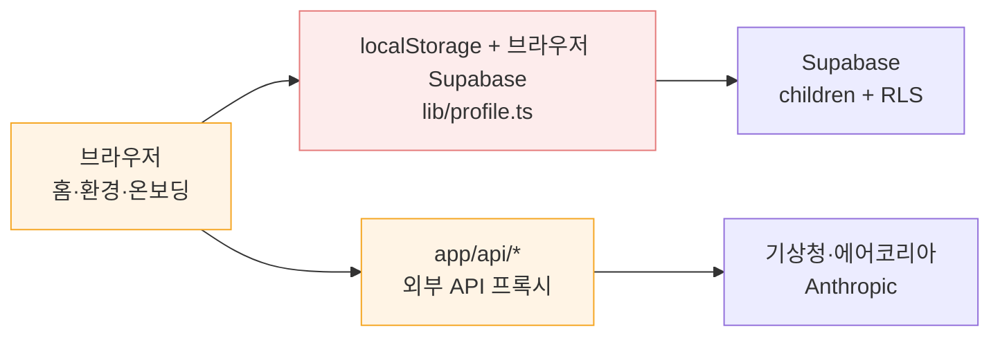

# Engineering Plan Review — 현재 로컬·GitHub 아키텍처

> Generated by `/plan-eng-review` on 2026-07-13
> Branch: `main` | Mode: **HOLD SCOPE**
> Repo: gnasnue/aiday-github

---

## 결론

현재 구조는 **작동하는 단일 Next.js MVP**로는 적절하다. `app/`의 App Router, 외부 키를 감춘 `app/api/`, Supabase RLS 마이그레이션, 작은 `lib/` 도메인 모듈이라는 출발점은 좋다.

그러나 다음 4주 목표인 브리핑 단일 원본·안전 규칙·피드백 기록을 올리기에는 경계가 아직 부족하다. 특히 브라우저가 프로필·환경 데이터를 조합해 AI API에 보내는 방식은 비용 보호, 데이터 신뢰, 일별 브리핑 영속화를 동시에 막는다.

**판정: HOLD SCOPE.** 폴더 전체를 `features/` 구조로 옮기는 리팩터링은 하지 않는다. 대신 `브리핑 생성` 한 흐름만 서버 중심 수직 슬라이스로 고정한 뒤, 그 패턴을 프로필·환경 화면에 점진적으로 적용한다.

---

## 시스템 감사

### 로컬과 GitHub 기준

| 구분 | 확인 결과 |
| --- | --- |
| 원격 저장소 | `https://github.com/gnasnue/aiday-github.git` |
| GitHub `main` | `52e40f8` (`v0.2.1.0`, 2026-07-13 원격 조회) |
| 로컬 `HEAD` | `52e40f8`; 원격 `main`과 커밋 차이 없음 |
| 로컬 작업 트리 | AI 게이트웨이 환경변수/`/api/report` 변경과 문서 정리 변경이 아직 원격에 없음 |
| GitHub 자동화 | `.github/` 디렉터리·CI 워크플로 없음 |
| 검증 | `npm.cmd run lint`, `npm.cmd run build` 통과 |

### 현재 구조와 책임

| 경로 | 현재 책임 | 판단 |
| --- | --- | --- |
| `app/` | 화면 라우트, App Router 레이아웃, 로그인/온보딩, API route handler | 적절한 시작점 |
| `app/(main)/` | 로그인 후 5개 화면 + 하단 내비게이션 | 페이지가 데이터 조합과 UI를 함께 가짐 |
| `app/api/` | 기상청·에어코리아·꽃가루·UV·Anthropic 프록시 | 키 보호는 되지만 도메인 서비스 경계 없음 |
| `lib/` | 프로필 저장/DB 동기화, 프롬프트, 추천, 날씨 표시 타입 | 브라우저 저장소·Supabase·도메인 타입이 혼재 |
| `components/` | 공통 제품 컴포넌트 + `components/ui/` shadcn 생성물 | 구분 자체는 적절함 |
| `supabase/migrations/` | `children` 테이블 1개와 RLS | 현재 MVP에는 충분, 다음 단계에는 확장 필요 |
| `docs/` | 제품 기준 문서·검토 기록 | 최근 Codex 문서 정리로 현재/보관 구분을 시작함 |



붉은 경계는 브라우저가 프로필과 외부 환경 입력을 직접 조합해 AI 호출을 결정하는 부분이다. 일별 브리핑 원본은 여기 어디에도 존재하지 않는다.

---

## 발견 사항

### T1 — P0 (BLOCKER): AI 브리핑의 신뢰 경계가 브라우저에 있다

`/api/report`는 인증 없이 호출되며, `child`, `weather`, `air` 전체를 요청 본문에서 신뢰한다. 따라서 비용이 드는 LLM 호출을 누구나 반복할 수 있고, 서버는 어떤 아이·어떤 지역·어떤 입력으로 만들어진 브리핑인지 보장할 수 없다. 이 구조에서는 `daily_briefings` 단일 원본, 레이트리밋, 안전 규칙의 선행 판정, 수동 발송과 홈의 동일 내용 보장이 모두 덧붙이기식 구현이 된다.

**현재 경계**

```ts
// app/(main)/home/page.tsx
fetch("/api/report", {
  method: "POST",
  body: JSON.stringify({ child, weather: w, air: a }),
});

// app/api/report/route.ts
const { child, weather, air } = body as { /* 브라우저 입력 */ };
```

**권장 경계**

```ts
// POST /api/briefings/today
// body: { childId }
const user = await requireUser();
const child = await childRepository.findOwned(user.id, childId);
const environment = await environmentService.forRegion(child.regionCode);
const safety = evaluateSafety(child, environment);
return briefingService.getOrCreateToday({ child, environment, safety });
```

첫 구현은 새 범용 프레임워크가 아니라 이 엔드포인트 하나면 된다. 입력은 `childId`만 받고, 서버가 소유권·프로필·지역·환경을 결정하며, 결과를 하루 한 번 저장한다. 게스트 체험은 실제 LLM 호출 대신 정적 예시 브리핑으로 분리한다.

### T2 — P1 (CRITICAL): 환경 데이터의 변환·캐시 책임이 페이지마다 흩어져 있다

홈은 `useEffect`에서 날씨/대기질을 직접 fetch해 `weatherRawRef`에 보관하고, 또 다른 effect에서 AI 요청을 보낸다. 표시용 `WeatherData`에는 `mockWeather`를 펼친 뒤 일부 실데이터만 덮어쓴다. 환경 화면도 별도의 fetch·표시 변환·더미 섹션을 가진다. API route는 외부 형식을 그대로 반환한다.

이 방식은 현재는 빠르지만, 동일한 "오늘의 환경"이 홈·브리핑·수동 발송·피드백에서 서로 다른 값이나 시각을 가질 위험이 있다. 캐시 키 버전 규칙도 클라이언트 리포트 키에만 존재한다.

**현재 패턴**

```ts
// 화면에서 외부 API 응답 + 표시 모델 + mock fallback을 함께 조합
setWeatherData({
  ...mockWeather,
  temp: w.temperature ?? mockWeather.temp,
  humidity: w.humidity ?? mockWeather.humidity,
});
```

**권장 패턴**

```ts
// lib/server/environment/service.ts
export async function getDailyEnvironment(region: Region): Promise<EnvironmentSnapshot> {
  const [weather, air, pollen, uv] = await Promise.all(/* provider adapters */);
  return normalizeEnvironment({ weather, air, pollen, uv, observedAt: new Date() });
}
```

`EnvironmentSnapshot` 하나를 브리핑 저장의 `input_snapshot`과 홈 화면의 근거 카드에 공용으로 쓴다. API route는 이 서비스의 얇은 어댑터가 되고, mock은 개발/실패 fallback으로만 명시적으로 분리한다.

### T3 — P1 (CRITICAL): 프로필이 localStorage·브라우저 DB 동기화·페이지 상태에 3중으로 존재한다

`lib/profile.ts`는 도메인 타입, 데모 데이터, localStorage 읽기/쓰기, 브라우저 Supabase 호출, DB 행 변환을 모두 가진다. 각 화면은 `loadProfiles()`와 자체 `useState`로 다시 상태를 만든다. 지금은 게스트 지원을 위한 타협이지만, 서버에서 일별 브리핑을 만들거나 여러 기기에서 일관된 프로필을 사용하려면 장애물이 된다.

**현재 패턴**

```ts
// lib/profile.ts
export const loadProfiles = () => localStorage.getItem(PROFILES_KEY) /* ... */;
export async function syncProfilesFromDb() { /* DB → localStorage */ }
```

**권장 분리**

```text
lib/domain/profile.ts            # ChildProfile, 값 정규화, 표시 매핑
lib/repositories/children.ts     # 서버용 Supabase CRUD·소유권
lib/client/profile-cache.ts      # 게스트/화면 상태의 제한된 localStorage 캐시
```

로그인 사용자의 원본은 DB로 정하고, localStorage는 렌더링 캐시와 게스트 임시 입력으로만 제한한다. 이 분리는 T1의 서버 브리핑 endpoint를 만들 때 함께 최소 범위로 적용한다.

### T4 — P1 (CRITICAL): 데이터베이스 변경의 확장 경로와 타입 계약이 없다

저장소에는 `001_children.sql` 하나만 있다. RLS는 올바르게 시작했지만, 다음 P0에 필요한 브리핑·행동 피드백·발송 기록·동의 버전·레이트리밋 테이블은 아직 없고, 애플리케이션은 `Record<string, unknown>` 캐스팅으로 DB 행을 다룬다.

**현재 패턴**

```ts
function rowToProfile(row: Record<string, unknown>): ChildProfile {
  return { id: row.id as string, name: row.name as string /* ... */ };
}
```

**권장 순서**

```text
002_normalize_children.sql
003_daily_briefings.sql
004_action_feedback.sql
005_consent_and_rate_limits.sql
```

이번 4주에는 실제로 쓰는 테이블만 추가한다. 각 migration에는 RLS, 소유권 제약, `(child_id, briefing_date)` 고유 제약을 함께 넣고, TypeScript에는 그 테이블의 명시 타입 또는 Supabase 생성 타입을 둔다. 나중에 필요할 테이블을 미리 모두 만들지는 않는다.

### T5 — P2 (MAJOR): 화면이 기능 단위가 아니라 대형 클라이언트 페이지 단위로 성장하고 있다

`home/page.tsx`는 약 600줄, `onboarding/page.tsx`는 약 660줄이며, 화면 표시·프로필 선택·네트워크 호출·캐시·AI fallback을 한 파일에서 처리한다. `@tanstack/react-query`는 전역 Provider에만 있고 실제 `useQuery` 경계는 없다.

**현재 패턴**

```tsx
// app/(main)/home/page.tsx
useEffect(() => fetchEnv(), []);
useEffect(() => fetchReport(), [aiLoading, cur?.id]);
return <HomeScreen /* data fetching + rendering 혼재 */ />;
```

**점진적 분리**

```text
features/briefing/api.ts        # /api/briefings/today 호출
features/briefing/use-briefing.ts
features/briefing/BriefingCard.tsx
features/environment/EnvironmentEvidence.tsx
```

먼저 홈의 브리핑과 시간대 근거 카드만 분리한다. 모든 기존 페이지를 feature 폴더로 옮기거나 React Query를 전면 도입하지 않는다. 도입한다면 환경·브리핑의 요청 중복과 invalidation을 실제로 해결하는 범위로 제한한다.

### T6 — P2 (MAJOR): GitHub에는 변경을 검증·보호하는 자동화 경계가 없다

원격 저장소에 `.github/`가 없어 Actions, PR 템플릿, CODEOWNERS, 배포 전 확인이 없다. `main`이 원격과 동기화된 것은 확인됐지만, `build`·`lint` 통과는 현재 개발자의 로컬 실행에 의존한다. 특히 외부 API와 민감한 아동 프로필을 다루는 변경은 리뷰와 최소 회귀 검증이 필수다.

**현재 구조**

```text
.github/  # 없음
```

**최소 도입안**

```yaml
# .github/workflows/ci.yml
on: [pull_request]
jobs:
  verify:
    steps: [checkout, setup-node, npm ci, npm run lint, npm run build]
```

브랜치 보호 규칙에서 이 한 검사를 필수로 만든다. 이후 `scripts/eval-briefing.ts`가 생기면 같은 workflow에 추가한다. 배포·자동 릴리스·복잡한 bot은 지금 넣지 않는다.

### T7 — P3 (MINOR): 타입·설정·생성물의 잔재가 다음 변경의 신호를 흐린다

- `tsconfig.json`의 `strict: false`는 프로필/환경/AI 응답이 모두 불완전한 현재 코드에서 경계 오류를 숨긴다.
- `next.config.ts`는 존재하지 않는 legacy `src/`를 언급한다.
- `components/ui/`에는 현재 사용하지 않는 shadcn 생성물이 다수 있으며, Provider에는 두 종류의 toaster가 공존한다.
- 현재 API route는 `Number()` 변환 뒤 `NaN`을 별도 방어하지 않는 구간이 있고, weather 좌표·air 측정소도 allowlist가 아니다.

이 항목은 전면 정리하지 않는다. 브리핑 수직 슬라이스에서 Zod 입력 검증과 명시 타입을 먼저 적용하고, 이후 변경하는 영역부터 `strict` 호환으로 바꾼다. 사용하지 않는 UI 생성물 삭제는 제품 기능과 무관하므로 별도 작은 PR로만 처리한다.

---

## 권장 목표 구조 (4주 이후 확장 가능한 최소 형태)

```text
app/
  (main)/home/page.tsx                 # 조합만 담당
  api/briefings/today/route.ts         # 인증된 브리핑 진입점
  api/environment/today/route.ts       # 필요 시 화면용 읽기 endpoint
lib/
  domain/                               # profile, environment, safety, briefing 타입/순수 규칙
  server/                               # Supabase repository, 환경 provider adapter, LLM client
  client/                               # UI 전용 cache/hook 보조
features/
  briefing/                             # 홈 브리핑 UI·요청·상태
  environment/                          # 근거 카드 UI
supabase/migrations/                    # 순차 migration + RLS
```

이것은 즉시 파일 이동을 하라는 뜻이 아니다. 새로 만드는 브리핑 기능만 이 구조를 따라 시작하고, 기존 `lib/profile.ts`와 홈 코드를 해당 작업에서 필요한 부분만 추출한다.

---

## 우선순위

1. **T1 + T3:** 서버 소유 브리핑 생성 경계와 로그인 사용자 DB 원본을 먼저 만든다.
2. **T2 + T4:** 같은 환경 스냅샷과 순차 migration을 브리핑 저장에 연결한다.
3. **T5:** 홈에서 브리핑 수직 슬라이스만 분리한다.
4. **T6:** 첫 기능 PR 전에 `lint`·`build` GitHub Actions를 추가한다.
5. **T7:** 변경한 경계부터 타입/입력 방어를 강화한다.

*이 리뷰는 현재 로컬 작업 트리와 GitHub `main`을 비교해 구조를 평가한 문서이며, 애플리케이션 코드는 수정하지 않는다.*
